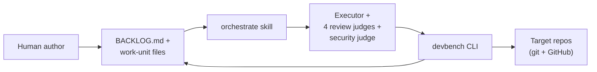
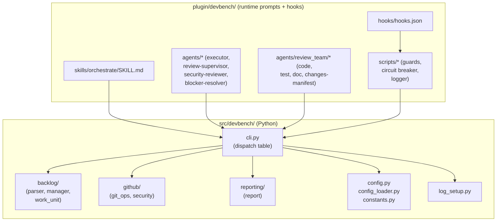
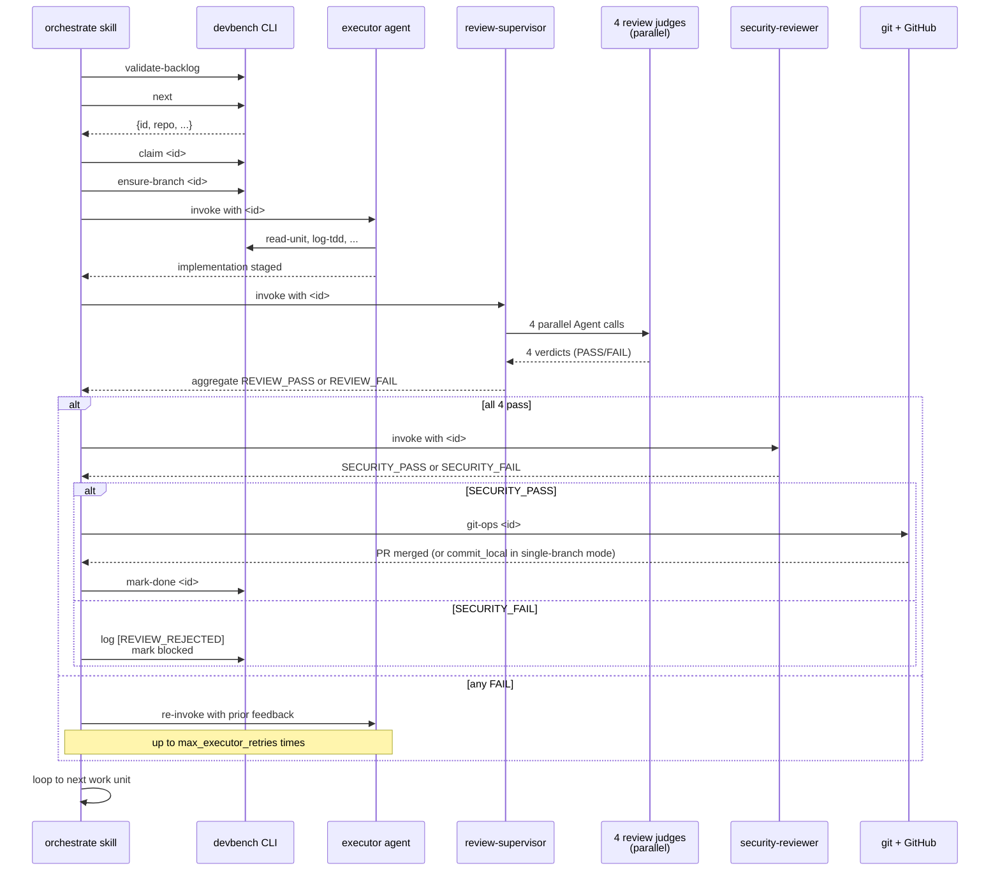
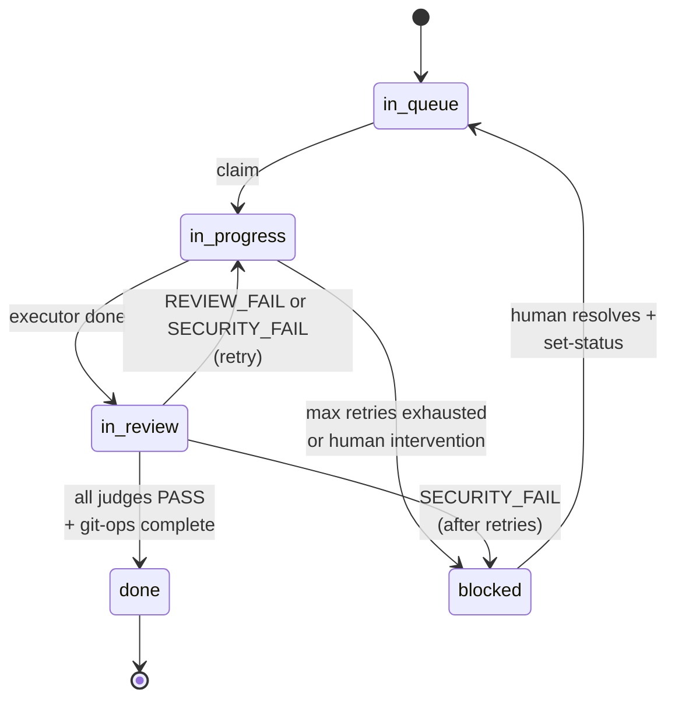
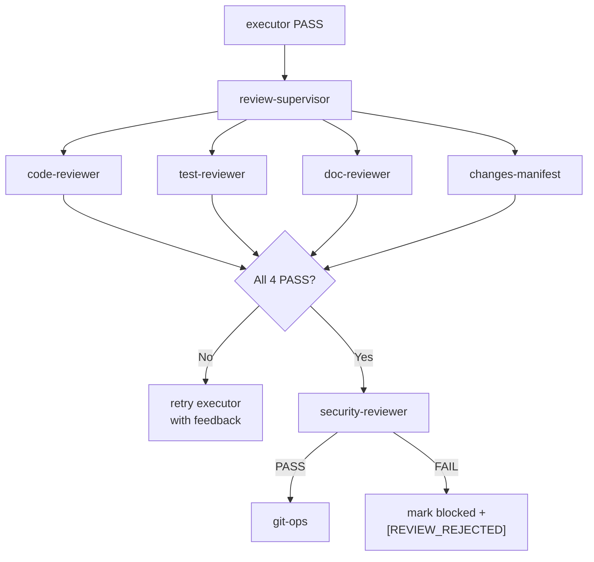
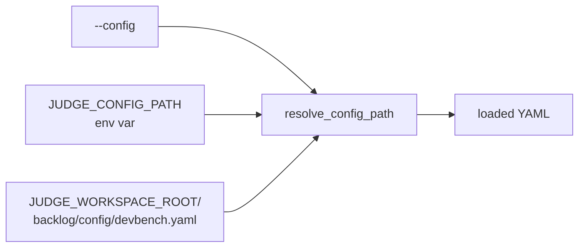

# DevBench Architecture

The single doc that explains how devbench works end-to-end. Read this first if you are new to the project, need to explain devbench to a stakeholder, or are about to make a non-trivial change.

This doc covers what devbench does today, how it is constructed, how the orchestration loop runs, how multiple repos and PR modes are configured, how the judge tier works (and how to swap a judge), the configuration model, the hooks layer, current gaps, known issues queued for separate fixes, a glossary, and links to the other docs that cover individual pieces in depth.

---

## Table of contents

- [1. Overview](#1-overview)
- [2. Capabilities](#2-capabilities)
- [3. Construction (components)](#3-construction-components)
- [4. Process flow (orchestration loop)](#4-process-flow-orchestration-loop)
- [5. Multi-repo vs single-repo](#5-multi-repo-vs-single-repo)
- [6. Multi-PR vs single-PR mode](#6-multi-pr-vs-single-pr-mode)
- [7. Judge architecture & how to swap judges](#7-judge-architecture--how-to-swap-judges)
- [8. Configuration model](#8-configuration-model)
- [9. Hooks layer](#9-hooks-layer)
- [10. Current gaps (known limitations)](#10-current-gaps-known-limitations)
- [11. Known issues to address separately](#11-known-issues-to-address-separately)
- [12. Glossary](#12-glossary)
- [13. See also](#13-see-also)

---

## 1. Overview

DevBench takes a structured backlog of work units (epics → features → stories → tasks) and drives them autonomously through a TDD implement / parallel-judge-review / security-review / git-merge pipeline. LLM agents do the implementation and reviews; a Claude Code skill (`orchestrate`) coordinates them; a Stop hook prevents context-compaction stalls so the loop survives long unattended runs.

The human role is to write the specification and the work-unit backlog. Everything from "claim the next task" to "merge the PR" runs without human intervention.



The arrows back to BACKLOG.md represent status writes and audit comments — every action by every agent is recorded in the work unit file's `## Comments` section so the loop can resume from any point after a restart.

---

## 2. Capabilities

What devbench does today, grouped by theme:

### Autonomous SDLC pipeline
- End-to-end backlog processing: spec → claim → implement (TDD) → 4-judge review → security review → commit → PR → CI → merge → mark-done → loop.
- No human-in-the-loop required for routine decisions.
- Recursive work-unit hierarchy (Epic → Feature → Story → Task) with automatic status rollup of parents when children complete.

### Multi-judge review
- Four review judges (code, test, doc, changes-manifest) run in parallel via `review-supervisor`.
- A separate security judge runs sequentially after the review tier passes.
- Done-gate enforces all four review judges must REVIEW_PASS before a unit can be marked done.
- Review failures inject prior feedback into the next executor attempt to prevent loops.

### Reliability
- **Stop hook circuit breaker** prevents the orchestrator from stopping mid-loop when Claude Code attempts to stop after context compaction. Configurable max blocks within a time window before allowing stop.
- **Stale task detection** warns when a task has been in-progress longer than a configurable threshold.
- **Pre-commit and pre-push hooks** block destructive bash commands, missing git stages, malformed verdict logs, and direct edits to work-unit markdown.
- **Idempotent git operations** — `commit_and_push` skips if nothing staged; `ensure_branch` handles dirty trees with stash/pop.

### Git workflow flexibility
- **Multi-PR mode (default)**: one branch and one PR per work unit. CI runs per PR.
- **Single-PR mode**: all work units commit to one shared branch; one PR for the whole batch via `git-ops-finalize`.
- Per-repo merge strategy override (merge / squash / rebase).
- Optional submodule pointer updates after PR merges.

### Multi-repo support
- One workspace can drive work across multiple target repos.
- `org/repo` keys in YAML; each repo has its own `default_branch`, `checkout_directory`, and merge strategy.
- Symlink pattern lets the backlog repo and target repos live independently on disk.

### Reporting & observability
- `devbench report` shows tasks completed, velocity, tokens consumed, estimated cost, and projection to completion.
- `--watch N` flag refreshes the report every N seconds (replaces the external `watch` command pattern).
- Token cost configurable per-model — see [model-pricing.md](model-pricing.md).
- Rollup metrics: stories / features / epics auto-rolled to done.
- Every tool call is logged to `hook-logs.jsonl` for cost accounting and audit.

### Configuration
- YAML primary, env-var overrides, code constants as last-resort defaults.
- Schema-validated YAML (additionalProperties: false catches typos).
- Per-agent model selection via skill / agent frontmatter.

### Auth flexibility
- Direct Anthropic API via Claude Code OAuth token.
- AWS Bedrock via boto3 credential chain.

---

## 3. Construction (components)



The CLI is the single entry point that the runtime prompts (skill, agents, hooks) call into. All Python logic lives behind the CLI. The plugin layer above the CLI is data — markdown prompts and JSON config — not code.

### Module map

| Module | File path | Responsibility |
| --- | --- | --- |
| CLI dispatch | `src/devbench/cli.py` | Single entry point; routes commands to handlers; bridges agents to backend logic |
| Constants | `src/devbench/constants.py` | All hard-coded structural values (regexes, status enums, judge names, defaults) |
| Config | `src/devbench/config.py` | Resolves env vars + YAML + constants into runtime values |
| Config loader | `src/devbench/config_loader.py` | Parses and JSON-schema-validates `devbench.yaml` |
| Schema | `src/devbench/config-schema.json` | JSON Schema for `devbench.yaml` |
| Backlog parser | `src/devbench/backlog/parser.py` | Parses `BACKLOG.md` index + work-unit files into `WorkUnit` objects |
| Backlog manager | `src/devbench/backlog/manager.py` | Status writes, done-gate, rollup, validation |
| Work unit model | `src/devbench/backlog/work_unit.py` | `WorkUnit`, `WorkUnitStatus`, `WorkUnitType` dataclasses |
| Git ops | `src/devbench/github/git_ops.py` | Branch, commit, push, PR create/wait/merge, submodule update |
| Security | `src/devbench/github/security.py` | CodeQL / Dependabot / secret scanning queries |
| Reporting | `src/devbench/reporting/report.py` | Velocity + token + cost report generator |
| Logging | `src/devbench/log_setup.py` | Stdout + file logging |
| Plugin: skill | `plugin/devbench/skills/orchestrate/SKILL.md` | The autonomous orchestration loop |
| Plugin: agents | `plugin/devbench/agents/` | Top-level agents (executor, review-supervisor, security-reviewer, blocker-resolver) |
| Plugin: judges | `plugin/devbench/agents/review_team/` | Four parallel review judges |
| Plugin: hooks | `plugin/devbench/hooks/hooks.json` | Maps Claude Code hook events to scripts |
| Plugin: scripts | `plugin/devbench/scripts/` | Bash hook implementations (guards, circuit breaker, logger) |

---

## 4. Process flow (orchestration loop)

The `orchestrate` skill drives the loop. Each iteration processes one work unit. The skill never asks for confirmation — it loops until all units are done or no actionable units remain.



### The work-unit state diagram



### Key behaviours

- **Done-gate**: `BacklogManager._last_round_all_passed()` scans the work-unit Comments in reverse, collecting REVIEW_PASS entries per judge. It stops at the first `[REVIEW_REJECTED]` line — that means a prior round was invalidated and only entries after that count. The gate passes only if all four judges in `REVIEW_JUDGE_NAMES` have a REVIEW_PASS in the most recent round.
- **Retry feedback injection**: On REVIEW_FAIL, the orchestrator pulls prior judge feedback from the orchestrator log and feeds it back to the executor on the next attempt, so the executor knows what to fix.
- **Auto-rollup**: When a task is marked done and all sibling tasks of its parent story are done, the parent story is auto-rolled to done with an audit comment. This cascades up to features and epics.
- **Stop hook intercepts**: If Claude Code attempts to stop while any task is in-progress in BACKLOG.md, `continue-orchestration.sh` blocks the stop and injects a continuation instruction (current task ID, file path, last action, recommended next step). After `stop_hook.max_blocks` blocks within `stop_hook.window_seconds`, the circuit breaker trips and allows the stop, logging an audit comment to the work unit.

---

## 5. Multi-repo vs single-repo

### The model

The workspace root contains `BACKLOG.md` and the `backlog/` directory with work-unit files and `config/devbench.yaml`. The YAML's `repos:` map declares one or more target repositories that the orchestrator will modify. Each work unit identifies its target via a `repo:` field that matches a key in the map (full `org/repo` or short name).

```yaml
# backlog/config/devbench.yaml
repos:
  caylent-solutions/repo-a:
    default_branch: main
    checkout_directory: repo-a
  caylent-solutions/repo-b:
    default_branch: develop
    checkout_directory: repo-b
    merge_strategy: rebase    # per-repo override
merge_strategy: squash         # default for all repos
```

`checkout_directory` is **relative** to the workspace root; absolute paths are rejected at config load time.

### Recommended directory layout

```
workspace-root/                            <-- JUDGE_WORKSPACE_ROOT
├── BACKLOG.md
├── backlog/
│   ├── config/devbench.yaml
│   └── E0/E0-F1/E0-F1-S1/E0-F1-S1-T1.md
├── repo-a/                                <-- symlink or real clone
└── repo-b/                                <-- symlink or real clone
```

The symlink pattern is preferred when the backlog lives in its own git repo: it lets you commit backlog progress independently of the target repos.

### Single-repo is just one entry

```yaml
repos:
  caylent-solutions/my-repo:
    default_branch: main
    checkout_directory: my-repo
```

There is no special "single-repo mode" — the multi-repo model handles both cases.

### How the CLI resolves repos

When a CLI command receives a repo argument (or reads the `repo:` field of a work unit), `config.resolve_repo()` accepts either the full `org/repo` name or the short name (the part after the slash) and returns the canonical full name. It then looks up the local filesystem path in `REPO_LOCAL_PATHS`. All git operations execute with `cwd` set to that path.

---

## 6. Multi-PR vs single-PR mode

DevBench supports two git workflow patterns. Both share the same review pipeline; they differ in when commits are pushed and PRs are created.

### Side-by-side comparison

| Aspect | Multi-PR (default) | Single-PR (single-branch + defer_pr) |
| --- | --- | --- |
| Branch per work unit | `backlog/<id>` (one branch each) | one shared branch from `git_ops.single_branch` |
| Commit cadence | Per work unit | Per work unit |
| Push cadence | Per work unit, immediately after commit | Deferred until `git-ops-finalize` |
| PR creation | After each unit's review passes | Once via `git-ops-finalize` after all units done |
| CI checks | One CI run per PR | One CI run on the whole batch |
| Merge | Auto-merge each PR after CI passes | Auto-merge the single PR after CI passes |
| Submodule pointer updates | Per-unit (if `update_submodule: true`) | Not supported |
| Best for | Independent work units that can ship separately | Related changes that must ship together |

### Multi-PR (default)

No special config — leave `git_ops.single_branch` and `git_ops.defer_pr` unset.

```yaml
git_ops:
  update_submodule: false   # set true if the target repo is a submodule
```

For each work unit, `devbench git-ops <id>` runs the full sequence: commit → push → create PR → wait for CI → merge → checkout default branch → optionally update parent submodule pointer.

### Single-PR mode

```yaml
git_ops:
  single_branch: feat/embed-repo-tool
  defer_pr: true
```

- Every work unit's `ensure-branch` checks out `feat/embed-repo-tool` instead of `backlog/<id>`.
- Every work unit's `git-ops` runs `commit_local()` only — no push, no PR.
- A `[COMMIT_DEFERRED]` comment is appended to each work unit so the audit trail shows what was committed.
- After all work units are complete (or any time you want to flush the batch), run `devbench git-ops-finalize <repo>`. This pushes the accumulated commits, creates the single PR, waits for CI, and merges.

### Validation rule

`git_ops.defer_pr: true` requires `git_ops.single_branch` to be set. The config loader raises `ValueError` at startup if you set `defer_pr` without a branch — the orchestrator can't run with that misconfiguration.

---

## 7. Judge architecture & how to swap judges

DevBench has a two-tier judge system.



### Tier 1 — Review tier (parallel, gated)

Four judges in `plugin/devbench/agents/review_team/`:

- `code-reviewer.md` — SOLID, DRY, fail-fast, evidence-based communication, security smells
- `test-reviewer.md` — TDD discipline, real tests not stubs, test framework discipline
- `doc-reviewer.md` — documentation accuracy, sync with code, no stale docs
- `changes-manifest.md` — declared changes match staged changes, no out-of-scope edits

`review-supervisor.md` invokes all four in parallel (single response with multiple `Agent` tool calls), aggregates verdicts, and emits a single REVIEW_PASS or REVIEW_FAIL.

### Tier 2 — Security gate (sequential, separate)

`security-reviewer.md` runs only after all four review judges PASS. A SECURITY_FAIL writes both `[SECURITY_FAIL]` and `[REVIEW_REJECTED]` comments — the latter resets the done-gate window, forcing the four review judges to re-run after the security fix lands. Security review is **not** retried; if it fails, the unit goes to blocked.

### Source of truth

`src/devbench/constants.py` defines:

```python
REVIEW_JUDGE_NAMES: frozenset[str] = frozenset({
    "code_review", "test_review", "doc_review", "changes_manifest"
})
SECURITY_JUDGE_NAMES: frozenset[str] = frozenset({"security_review"})
ALL_REQUIRED_JUDGE_NAMES: frozenset[str] = REVIEW_JUDGE_NAMES | SECURITY_JUDGE_NAMES
```

The done-gate (`BacklogManager._last_round_all_passed`) checks **only** `REVIEW_JUDGE_NAMES`. The security judge runs separately as described above.

### Adding a judge

Walkthrough adding a hypothetical `api-contract` judge that verifies API changes against an OpenAPI spec:

1. Create `plugin/devbench/agents/review_team/api-contract.md` with the standard agent frontmatter (`name`, `description`, `model`, `tools`, `disallowedTools`) and the review logic body. Use one of the existing judges as a template — the `name:` field becomes the judge's identifier in the verdict log.
2. Add `"api_contract"` to `REVIEW_JUDGE_NAMES` in `constants.py`.
3. (Optional) If `plugin/devbench/scripts/guard-verdict-format.sh` hard-codes the allowed judge names rather than importing from constants, update it to include the new name.
4. Mention the new judge in `docs/example-work-unit-template.md` so backlog authors know it exists.
5. Run `make validate` to confirm tests still pass.
6. Test end-to-end on a sample work unit.

`review-supervisor` discovers judges by listing `plugin/devbench/agents/review_team/*.md` at runtime, so no change to `review-supervisor.md` is required — it picks up the new agent automatically.

### Removing a judge

1. Delete the agent markdown file from `plugin/devbench/agents/review_team/`.
2. Remove the name from `REVIEW_JUDGE_NAMES` in `constants.py`.
3. Existing work units that have stale REVIEW_PASS entries from the removed judge in their Comments are still valid — the done-gate just ignores extra entries.

### Swapping a judge's logic

Edit the agent markdown body. Keep the `name:` field unchanged so the verdict pipeline keeps working. No Python changes required. The next review round will use the new logic; older REVIEW_PASS entries from the prior logic still satisfy the gate.

### Making a judge optional / advisory

Move the judge's name out of `REVIEW_JUDGE_NAMES`. The done-gate no longer requires it. You then choose whether to:

- Keep it in `review-supervisor`'s parallel invocation so its verdicts are logged for human review but don't block merging (advisory mode), or
- Remove it from `review-supervisor` too so it doesn't run at all.

---

## 8. Configuration model

### Path resolution (where the YAML comes from)



First match wins: explicit `--config` flag → `JUDGE_CONFIG_PATH` env var → default workspace path.

### Value resolution (where each setting comes from)

For each individual config value, three sources are consulted in priority order:

```
env var → YAML value → default constant
```

This is implemented by `_resolve_int`, `_resolve_float`, and `_resolve_str` in `src/devbench/config.py`. The first non-`None` source wins. There is no fallback chain (`a or b or c`) — each helper checks the env var explicitly, then the YAML field, then returns the default.

### Annotated YAML (every section)

```yaml
# backlog/config/devbench.yaml

# Required: at least one repo
repos:
  caylent-solutions/my-repo:
    default_branch: main           # optional: falls back to origin/HEAD
    checkout_directory: my-repo    # optional: relative to workspace root
    merge_strategy: squash         # optional: per-repo override

# Top-level: defaults for all repos
merge_strategy: squash
max_executor_retries: 10           # max retries before marking blocked
allowed_orgs:                      # optional: restrict to specific GH orgs
  - caylent-solutions
judge_model: claude-sonnet-4-6     # optional: model for review judges
executor_model: claude-opus-4-7    # optional: model for executor
use_bedrock: false                 # route LLM calls via Bedrock?
bedrock_region: us-east-1          # AWS region if use_bedrock: true

# Git workflow
git_ops:
  update_submodule: false
  single_branch: feat/my-feature   # optional: enables single-PR mode
  defer_pr: true                   # requires single_branch

# Cost reporting (see docs/model-pricing.md)
report:
  token_cost_per_million_input: 5.0    # Opus 4.7 default
  token_cost_per_million_output: 25.0
  token_cost_input_ratio: 0.80

# Stop hook circuit breaker
stop_hook:
  max_blocks: 5
  window_seconds: 180
  stale_task_minutes: 120

# Operational timeouts (seconds)
timeouts:
  gh_api: 30
  test: 300
  security_fetch: 120
  llm: 300
  command: 120
  executor: 1800
  executor_max_turns: 100
  orchestrator_poll_interval: 10
  github_check: 600

# Truncation and context limits
limits:
  alert_summary: 10
  output_truncation: 2000
  llm_evidence_truncation: 15000
  llm_file_context: 5
  llm_file_preview_chars: 3000
```

For the cost values under `report:`, see [model-pricing.md](model-pricing.md) for the right values per model.

---

## 9. Hooks layer

DevBench registers hooks for Claude Code events via `plugin/devbench/hooks/hooks.json`. Hooks run shell scripts that can either log silently or block the action by exiting with a non-zero code.

| Hook event | Matcher | Script(s) | Purpose |
| --- | --- | --- | --- |
| `PreToolUse` | `Bash` | `hook-logger.sh`, `guard-bash.sh`, `guard-verdict-format.sh`, `guard-git-stage.sh` | Audit log + block destructive bash + validate verdict format + require git stage before commit |
| `PreToolUse` | `Write` | `guard-work-unit-write.sh` | Block direct edits to work-unit markdown files (only orchestrate skill should modify them) |
| `PreToolUse` | `Edit` | `guard-work-unit-write.sh` | Same |
| `PreToolUse` | `.*` | `hook-logger.sh` | Catch-all audit log |
| `PostToolUse` | `Bash` | `hook-logger.sh`, `assert-tests-pass.sh` | Audit log + fail loop if test command exited non-zero |
| `PostToolUse` | `.*` | `hook-logger.sh` | Catch-all audit log |
| `PostToolUseFailure` | `.*` | `hook-logger.sh` | Audit log on tool failure |
| `UserPromptSubmit` | `.*` | `hook-logger.sh` | Audit log |
| `Stop` | (any) | `hook-logger.sh`, `continue-orchestration.sh` | Circuit-breaker continuation (see below) |
| `SubagentStart` | `.*` | `hook-logger.sh` | Audit log |
| `SubagentStop` | `.*` | `hook-logger.sh` | Audit log |
| `PreCompact` | `.*` | `hook-logger.sh` | Audit log before context compaction |
| `PermissionRequest` | `.*` | `hook-logger.sh` | Audit log |
| `Notification` | `.*` | `hook-logger.sh` | Audit log |

`${CLAUDE_PLUGIN_ROOT}` in the hooks.json command strings is interpolated by Claude Code at runtime to the absolute path of the loaded plugin directory (the value passed to `--plugin-dir`).

### The Stop hook circuit breaker (the headline reliability feature)

Why it exists: After Claude Code compacts its context (which it does automatically when context fills up), the resulting conversation can lose the orchestrate skill instructions. Without intervention, Claude would correctly conclude the conversation is over and stop — leaving an in-progress task hanging.

What `continue-orchestration.sh` does:

1. Reads `BACKLOG.md` to find any in-progress task.
2. If no task is in-progress, allows the stop and clears the circuit-breaker state file.
3. If a task is in-progress:
   - Detects whether the work-unit file has transitioned to `blocked` (mismatch with BACKLOG.md) and instructs `devbench next` if so.
   - Detects whether the in-progress task is older than `stop_hook.stale_task_minutes` (default 120) and adds a stale-task warning.
   - Reads the most recent agent / judge comment from the work-unit file to determine the last action.
   - Suggests the specific next step based on the last action (run review-supervisor, run security-reviewer, run git-ops, etc.).
   - Increments the block counter in `/tmp/devbench-stop-hook-state.json`.
   - If the counter has reached `stop_hook.max_blocks` within `stop_hook.window_seconds` (default 5 / 180s), trips the circuit breaker: allows the stop, logs a `[CIRCUIT_BREAKER]` comment to the work unit so a human can investigate, and clears the state file.
   - Otherwise blocks the stop with a JSON `{"decision": "block", "reason": "..."}` envelope that injects the continuation instruction into Claude's next turn.

The circuit breaker prevents tight stop-block loops from running forever; it also creates an audit trail in the work unit's Comments so a human can see why the loop ended.

Configuration is under `stop_hook:` in the YAML, with env var overrides `JUDGE_STOP_MAX_BLOCKS`, `JUDGE_STOP_WINDOW_SECONDS`, `JUDGE_STOP_STALE_MINUTES`.

---

## 10. Current gaps (known limitations)

Pulled from the in-queue items in [ROADMAP.md](../ROADMAP.md) and the architecture audit:

- **Configuration completeness**: Not all model selection / timeout values are YAML-configurable yet (E210). Some values still require env-var overrides.
- **Misleading class name**: `GitOpsJudge` should be `GitOpsService` — it isn't actually a judge in the LLM-judge sense (E214). Pure rename, no behavior change.
- **Branch uniqueness**: `validate-backlog` doesn't catch branch-name collisions across work units (E219). Manual editing of the Branch field in two units to the same value will not error.
- **Work-unit scaffolding**: No CLI command to scaffold a new epic / feature / story / task from a template (E223). Authors copy-paste from `docs/example-work-unit-template.md` today.
- **`hold` status not implemented**: The `hold` status (for paused-by-human work) is planned but not implemented (E222). This blocks E215 and E220.
- **No `status --detail` flag**: Backlog status output is summary-only; no per-unit drill-down (E220, blocked on E222).
- **Dependency integrity gaps**: `_deps_satisfied` only checks task-to-task dependencies, not task-to-epic / feature / story (E215, blocked on E222).
- **`blocker-resolver` agent not invoked**: The agent file at `plugin/devbench/agents/blocker-resolver.md` exists but the orchestrate skill does not currently call it. Blocked work units stay blocked until human intervention.
- **No topological sort for parallel candidates**: `get_parallel_candidates` returns units in linear order rather than running a topological sort over the dep graph. This affects ordering when many parallel candidates exist.
- **Per-judge retry limits don't exist**: `max_executor_retries` is global; you can't configure "retry the executor 5 times if test-reviewer fails but only 2 times if doc-reviewer fails."
- **Cost report doesn't model cache savings**: `devbench report` uses base input rates; real cost is lower when prompt caching is active. Estimates may overstate spend.
- **Cost report doesn't split by role**: Single blended rate; no per-agent (executor vs judge) cost breakdown.
- **`devbench list-agents` CLI command doesn't exist**: Referenced in `review-supervisor.md` but the bash fallback (`ls plugin/devbench/agents/review_team/*.md`) is what works in practice. See [Known issues](#11-known-issues-to-address-separately).

---

## 11. Known issues to address separately

Items found during the documentation audit and queued for separate follow-up work. The earlier round of fixes in this PR closed out the `list-agents` reference, the non-standard agent prompt headers, and the stale token cost defaults; the items below remain open:

- **Out-of-scope-findings boilerplate is duplicated across all 8 agent prompts.** Should be extracted to a shared section the agents reference. Future prompt cleanup.
- **Cost report's `tasks_in_session` semantics are confusing.** Without `--since`, the report covers the entire log history, which is rarely what "session" means to a user. Either change the default behavior to use the most recent orchestrator restart as the session start, or rename the field.

---

## 12. Glossary

- **Work unit** — Any node in the backlog hierarchy (epic, feature, story, or task). Each work unit has its own markdown file under `backlog/`.
- **Task** — A leaf-level work unit (`E*-F*-S*-T*` ID format). Tasks are the only nodes the executor agent operates on; parents are status-roll-up containers.
- **Story** — A grouping of tasks that share a goal. ID format `E*-F*-S*`.
- **Feature** — A grouping of stories. ID format `E*-F*`.
- **Epic** — Top-level grouping. ID format `E*` (e.g., `E0`, `E215`).
- **Judge** — An LLM agent that evaluates the executor's work and emits a REVIEW_PASS or REVIEW_FAIL verdict.
- **Review tier** — The four parallel review judges (code, test, doc, changes-manifest). All must REVIEW_PASS for the done-gate to pass.
- **Security gate** — The single security-reviewer judge that runs sequentially after the review tier passes.
- **Done-gate** — The check (`BacklogManager._last_round_all_passed`) that ensures all four review judges have REVIEW_PASS in the most recent review round before a work unit can be marked done.
- **REVIEW_PASS** — Successful judge verdict, written to the work unit's Comments section.
- **REVIEW_FAIL** — Failed judge verdict, triggers retry of the executor with prior feedback injected.
- **REVIEW_REJECTED** — Sentinel comment that resets the done-gate window. Written when security fails to force the review tier to re-evaluate after a security fix.
- **Multi-PR mode** — Default git workflow: one branch and one PR per work unit.
- **Single-PR mode** — `git_ops.single_branch` + `git_ops.defer_pr: true`. All work units commit to one branch; one PR for the batch.
- **Stop hook** — Claude Code hook (`continue-orchestration.sh`) that blocks unintended stops mid-loop, with a circuit breaker to prevent infinite block-stop loops.
- **Circuit breaker** — Counter-and-window mechanism in the Stop hook that allows a stop after N blocks within T seconds.
- **Auto-rollup** — When all children of a parent work unit are done, the parent is automatically marked done with an audit comment.
- **Traceability matrix** — Table of `Spec Ref | Test Ref | Verified At` rows maintained by `BacklogManager.log_to_traceability_matrix()`.
- **Comments section** — The `## Comments` block in each work-unit markdown file. All judge verdicts and agent comments are appended here as the audit trail.

---

## 13. See also

- [README.md](../README.md) — Quick start, install, basic usage
- [model-pricing.md](model-pricing.md) — Per-model token costs and YAML snippets
- [execution-modes.md](execution-modes.md) — Detailed step-by-step lifecycle for both interactive and automated modes
- [backlog-contract.md](backlog-contract.md) — Required structure of `BACKLOG.md` and work-unit files
- [creating-specs-and-backlogs.md](creating-specs-and-backlogs.md) — How to author a new backlog from a spec
- [example-work-unit-template.md](example-work-unit-template.md) — Concrete template to copy when authoring tasks
- [plugin-architecture.md](plugin-architecture.md) — Plugin / agent / hook implementation details
- [llm-authentication.md](llm-authentication.md) — How devbench authenticates with the Claude API and Bedrock
- [adr/01-claude-agent-sdk-with-plugins.md](adr/01-claude-agent-sdk-with-plugins.md) — The decision record behind the SDK + plugins architecture
- [ROADMAP.md](../ROADMAP.md) — In-queue, blocked, and technical-debt items
