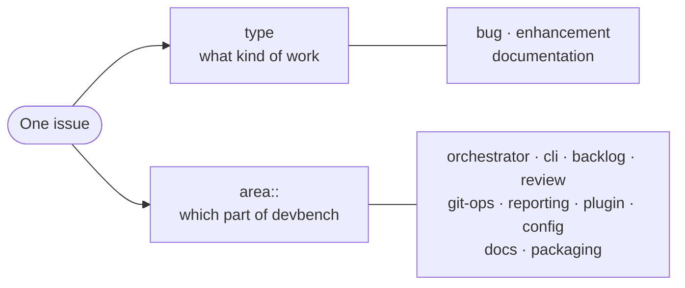
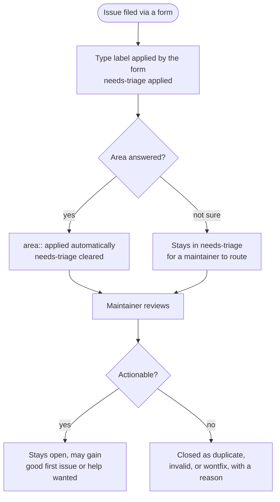

# Issue tracker

How issues are filed, labelled, and triaged in this repository.

The short version: **pick a form, answer the questions, and the labels are applied for you.** You do
not need to know the label scheme to file a good issue.

---

## Filing

<https://github.com/caylent-solutions/devbench/issues/new/choose> offers three forms:

| Form | Use it for | Applies |
|---|---|---|
| Bug report | devbench does not behave as documented | `bug` |
| Feature request | A new capability, or an improvement to one that exists | `enhancement` |
| Documentation | Docs are wrong, missing, or unclear | `documentation` |

Each form also asks which **area** of devbench is involved, and a workflow turns that answer into an
`area::` label on submit.

Blank issues are still available if none of the forms fit. They arrive with no labels and are
triaged by hand.

**Do not file security vulnerabilities as issues.** See [SECURITY.md](../SECURITY.md).

---

## Labels

Two axes, applied independently.

### Type

Applied by the form you choose. One per issue.

| Label | Meaning |
|---|---|
| `bug` | Behaviour does not match documented behaviour |
| `enhancement` | New capability, or an improvement to an existing one |
| `documentation` | Docs are wrong, missing, or unclear |

### Area

Applied automatically from your answer. The values mirror the source layout, so an issue can be
routed without anyone reading it closely.

| Label | Covers | Roughly |
|---|---|---|
| `area::orchestrator` | Orchestrate loop, sessions, daemon lifecycle, drain, quota | `session.py`, `drain.py`, `watchdog.py` |
| `area::cli` | Command surface, flags, help, exit codes | `cli.py` |
| `area::backlog` | Work units, `validate-backlog`, manifests, proposals, dependencies | `backlog/` |
| `area::review` | Judges, review pipeline, verdicts, retry budgets | `plugin/` review agents |
| `area::git-ops` | Branching, staging, commits, PRs, CI integration | `github/`, `git_orphans.py` |
| `area::reporting` | `status`, `report`, notifications, liveness, metrics | `reporting/`, `notifications.py` |
| `area::plugin` | Plugin, skills, agent definitions, hooks | `plugin/`, `plugin_shadow.py` |
| `area::config` | `devbench.yaml`, schema, env resolution | `config.py`, `config_loader.py` |
| `area::docs` | Documentation and examples | `docs/` |
| `area::packaging` | Build, release, dependencies, CI workflows | `pyproject.toml`, `.github/workflows/` |

Choosing **"not sure"** is fine and expected. It leaves `needs-triage` on the issue so a maintainer
assigns the area. You should not have to know our internal structure to report a problem.

### Triage state

| Label | Meaning |
|---|---|
| `needs-triage` | Not yet categorised by a maintainer |
| `good first issue` | Small, well-scoped, and a reasonable entry point |
| `help wanted` | Maintainers would welcome a contributor taking this |
| `duplicate` / `invalid` / `wontfix` | Triage outcomes; the issue is closed with a reason |

Priority is deliberately **not** a label. On a public repository it is a maintainer judgement that
depends on roadmap and capacity, and asking a reporter to guess at it produces noise rather than
signal.

---

## Finding things

Because type and area are independent, most questions are a two-label filter:

| Question | Query |
|---|---|
| Open bugs in the orchestrator | `is:open label:bug label:area::orchestrator` |
| Everything about the backlog format | `is:open label:area::backlog` |
| Where can I start contributing? | `is:open label:"good first issue"` |
| What needs maintainer attention? | `is:open label:needs-triage` |
| Docs gaps | `is:open label:documentation` |

---

## What happens after you file

Automation only ever *adds* the labels your answers imply. It never closes an issue, never assigns
priority, and never guesses an area you did not choose.

---

## For maintainers

The forms live in [`.github/ISSUE_TEMPLATE/`](../.github/ISSUE_TEMPLATE) and the labelling workflow
in [`.github/workflows/apply-issue-labels.yml`](../.github/workflows/apply-issue-labels.yml).

Adding an area means three edits, and all three are required or the label will never be applied:

1. Create the `area::<name>` label.
2. Add the option to the `Area` dropdown in all three forms.
3. Add the name to the alternation in the workflow's area regex.
