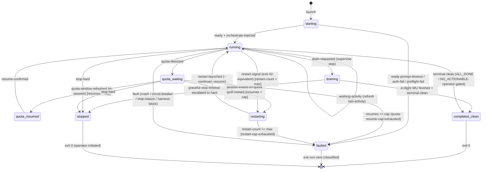
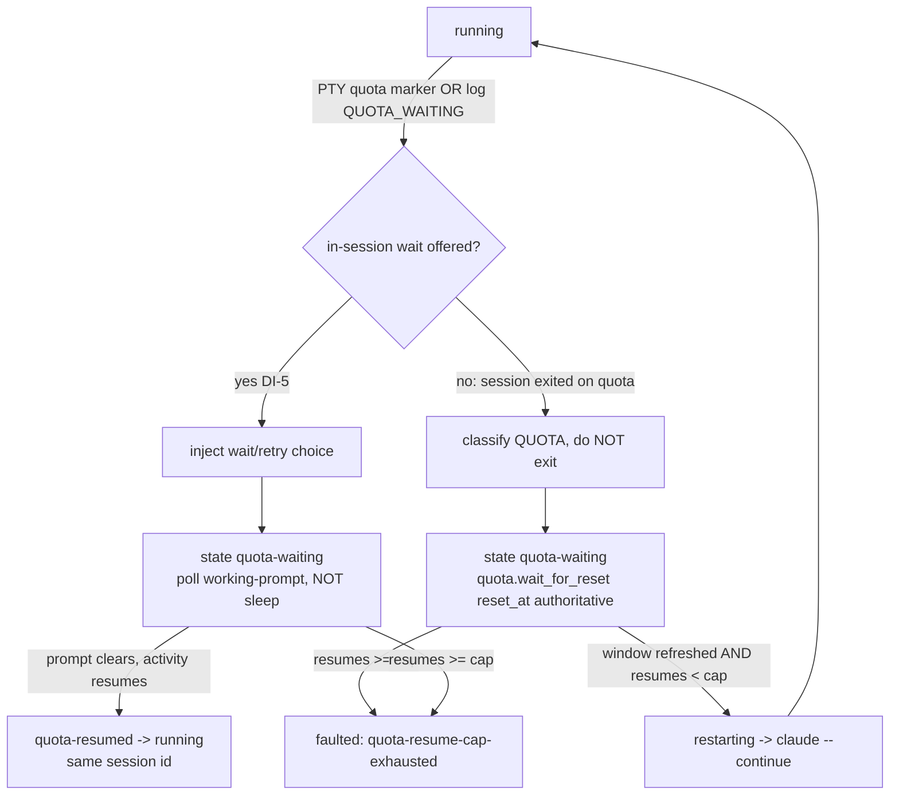
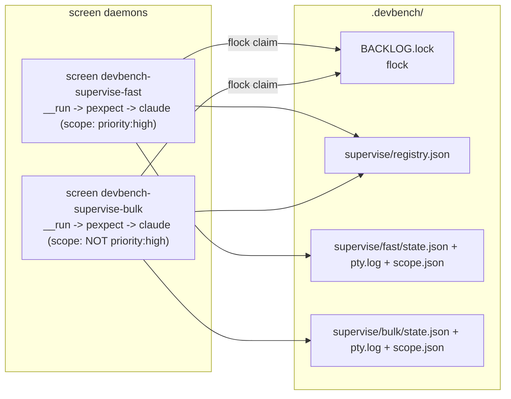
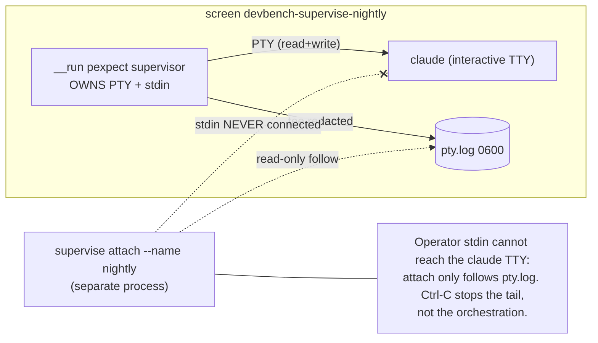

# Spec: `devbench supervise` -- Interactive `claude` CLI Orchestrator under a Detached `screen` Daemon

> Author note on glyphs: this spec uses ASCII double-hyphen `--` everywhere a dash is needed. The em-dash glyph (U+2014) is banned by the create-spec deterministic gates and does not appear in this file.

## Target Repository

- **Repo:** `caylent-solutions/devbench`
- **Branch:** `main`

---

## Section 0 -- Items That Change Existing User-Facing Behavior (and the Primary Goal)

### 0.1 Behavior-change ledger

This feature is **net-new and purely additive**. It introduces a NEW command verb group `devbench supervise {start|stop|restart|status|info|attach}` and a NEW `supervise:` config block. It does **not** alter, deprecate, or remove any existing launch path:

| Existing surface | Status after this spec | Notes |
|---|---|---|
| `devbench start` / `make start` (Agent-SDK, non-interactive) | UNCHANGED | The `ClaudeSDKClient` path at `cli.py:9298` is not touched. |
| `devbench start --daemon` (Agent-SDK, double-forked background) | UNCHANGED | `_daemonize_to_background` at `cli.py:7644` is not touched. |
| `make start-interactive` (foreground `claude --plugin-dir`) | UNCHANGED | `Makefile:140-145` is not touched; the new feature daemonizes a hardened variant of this same interactive launch under `screen`. |
| `devbench restart`, `devbench stop`, `devbench sessions`, `devbench status` | UNCHANGED | New `supervise` verbs are siblings, not replacements. |
| `quota_handling:` config block | UNCHANGED, REUSED | The new path reuses the exact same `QuotaHandlingConfig` semantics (`config_loader.py:736`). |

The ONLY change a reviewer must scrutinize for policy concerns: the supervised session launches `claude` with `--dangerously-skip-permissions` (Section 3.6 establishes this is safe only inside the recognized devcontainer sandbox, non-root) and **deliberately strips `ANTHROPIC_API_KEY` from the session environment** (Section 0.2 establishes why this is a correctness requirement, not a regression).

### 0.2 PRIMARY GOAL -- the raison d'etre: subscription billing, not API billing

The single reason this feature exists is to change **how the orchestrator's token consumption is billed**.

- **The current SDK path bills at API rates.** `devbench start` drives a `ClaudeSDKClient` (`cli.py:9298`). Per `docs/llm-authentication.md:11-39`, that path authenticates by reading the Claude Code OAuth `accessToken` (scope `user:inference`) out of `~/.claude/.credentials.json` and handing it to the Anthropic SDK as an `api_key`. Inference is metered against the **Anthropic API account** (or, under `DEVBENCH_USE_BEDROCK=1`, against AWS Bedrock; `docs/llm-authentication.md:108-138`). Either way, the orchestrator's tokens are billed per-token at API/Bedrock rates.
- **An interactive `claude` CLI session billed against the Max subscription draws from rolling 5-hour budget windows instead.** When an operator runs `claude` interactively, authenticated via their Claude Code subscription login (the Max plan), the session's token consumption is drawn from the subscription's rolling 5-hour usage windows -- it is NOT metered as per-token API spend.
- **Therefore this feature launches the orchestrator as an interactive `claude` CLI session** (not the SDK, and explicitly NOT `claude -p`/`--print`, which is a non-interactive batch mode the operator has excluded), wrapped in a `screen` daemon so it survives terminal detach, and driven by a Python `pexpect` supervisor so the run is unattended and self-healing.

**CRITICAL CORRECTNESS REQUIREMENT (the feature is pointless if violated):** an interactive `claude` session whose environment contains `ANTHROPIC_API_KEY` (or `ANTHROPIC_AUTH_TOKEN`, or other API-key vars) silently routes inference to **API billing** and defeats the entire purpose. The supervisor MUST:

1. **Unset / strip** `ANTHROPIC_API_KEY`, `ANTHROPIC_AUTH_TOKEN`, `ANTHROPIC_API_URL`, `ANTHROPIC_BASE_URL`, and `DEVBENCH_USE_BEDROCK`/`AWS_*` Bedrock-routing vars from the environment handed to the `screen` session (so neither `screen` nor `claude` nor any child sees them). See FR-21.
2. **Verify subscription auth before/at launch:** confirm `~/.claude/.credentials.json` exists and carries a `claudeAiOauth.accessToken` with the `user:inference` scope (the same file `docs/llm-authentication.md:17-23` documents), failing fast with a clear, actionable error if it is absent or if any forbidden API-key var is present. See FR-20, FR-21.
3. **Surface the billing channel in `status`/`info`** so the operator can confirm at a glance the session is subscription-authed, not API-keyed. See FR-9, FR-11.

This goal is restated in Section 2 (worked examples), Section 3.6 (trust/billing model), and Section 13 (resolved decisions D-1).

---

## Section 1 -- Context (Current Verified State of the Codebase)

All citations below were read directly from the working tree on branch `main`. File sizes are from `ls -la src/devbench/`.

### 1.1 The two existing launch paths

**(a) Agent-SDK path (`devbench start`).** `cmd_start` is defined at `cli.py:8974`. There is no argparse: argv is parsed by hand in `_parse_start_args` (called at `cli.py:9039`). The `--daemon`/`-d` flag is parsed at `cli.py:7755-7757`; daemonization double-forks via `_daemonize_to_background` (`cli.py:7644`), `os.setsid()` at `cli.py:7683`, redirecting stdout/stderr to `<workspace>/logs/orchestrator.log` (`cli.py:7694-7702`). The SDK is imported at `cli.py:9035` (`from claude_agent_sdk import ClaudeAgentOptions, ClaudeSDKClient`) and the options object is built at `cli.py:9235-9239`:

```python
options = ClaudeAgentOptions(
    plugins=[{"type": "local", "path": str(plugin_path)}],
    permission_mode="bypassPermissions",
    model=_orchestrator_model,
)
```

The client is opened and the kickoff query sent at `cli.py:9298-9299`:

```python
async with ClaudeSDKClient(options=options) as client:
    await client.query(_orchestrate_prompt)
```

The kickoff prompt literal is at `cli.py:9240`: `"Run the devbench-orchestrate:orchestrate skill to process the backlog until complete"`.

**(b) Interactive path (`make start-interactive`).** `Makefile:140-145` already launches an interactive `claude` against the plugin:

```make
start-interactive:
	claude --plugin-dir plugin/devbench
else
start-interactive:
	claude --dangerously-skip-permissions --plugin-dir plugin/devbench
```

This is the launch the new feature hardens, daemonizes under `screen`, and drives via `pexpect`. The interactive path is the subscription-billed channel (`docs/llm-authentication.md:102` confirms the Claude Code CLI itself manages OAuth token refresh while an interactive session is active).

### 1.2 Model resolution (no fallback, two decoupled models)

- `DEVBENCH_CLAUDE_MODEL` is a **required** env var resolved at import time in `config.py:345-348` via `_require_env` (which `sys.exit(2)`s when unset, `config.py:174-196`). It governs the SDK caller's model and is stamped into PID-file metadata at `cli.py:8460`.
- `orchestrate.model` is the SDK-launched orchestrator model, parsed in `config_loader.py` (field at `config_loader.py:660`, default `None`) and resolved by `_resolve_orchestrator_model` (`cli.py:7148-7176`) with **no fallback** -- it fails fast via `_OrchestratorModelUnsetError` when unset (`cli.py:7165-7167`). The operator-facing example default is `claude-opus-4-8` (`cli.py:7171`).
- Short names `opus`/`sonnet` and full Anthropic ids are validated (not defaulted) by `validate_agent_model_value` (`config_loader.py:1455-1521`); `haiku` is unconditionally rejected (`config_loader.py:1495-1502`; rationale `docs/llm-authentication.md:186`).

The new `supervise.model` field MUST mirror this no-fallback contract and resolve in this order: `--model` CLI flag > `supervise.model` (devbench.yaml) > `orchestrate.model` (devbench.yaml) > fail-fast (Section 5.4, D-3). Note `DEVBENCH_CLAUDE_MODEL` is **not** in this chain -- it routes API billing context and must not leak into the interactive session (Section 0.2).

### 1.3 Plugin shadow + orchestrate slash command

- The canonical plugin is at `plugin/devbench-orchestrate/`; its `.claude-plugin/plugin.json` declares `"name": "devbench-orchestrate"`, `"version": "0.4.0"`.
- The orchestrate skill is at `plugin/devbench-orchestrate/skills/orchestrate/SKILL.md` (frontmatter `name: orchestrate`). The interactive slash-command form is **`/devbench-orchestrate:orchestrate`** (plugin-name `:` skill-name), confirmed at `config_loader.py:627`, `cli.py:7173`, and `config-schema.json:335`.
- `_resolve_plugin_path` (`cli.py:7041-7051`) materialises a per-workspace shadow plugin tree when per-agent model overrides are present, else returns the canonical path:

```python
canonical = Path(__file__).parent.parent.parent / DEFAULT_PLUGIN_SUBPATH
shadow = materialise_shadow_plugin(canonical, WORKSPACE_ROOT, AGENT_MODELS)
return shadow if shadow is not None else canonical
```

- `shadow_plugin_path(workspace_root)` returns `workspace_root / PLUGIN_SHADOW_DIR_NAME / "devbench"` (`plugin_shadow.py:100-115`); `PLUGIN_SHADOW_DIR_NAME = ".devbench/plugin-shadow"` (`constants.py:897`). So the shadow lives at `<workspace>/.devbench/plugin-shadow/devbench/`.
- `devbench prepare-plugin-shadow` (`cmd_prepare_plugin_shadow` at `cli.py:9472`, registered at `cli.py:12867`) prints the resolved shadow path for interactive launchers. `docs/llm-authentication.md:223-227` documents `claude --plugin-dir "$(uv run devbench prepare-plugin-shadow)"`.

The supervisor MUST point `--plugin-dir` at exactly this resolved path so interactive and SDK modes share one plugin-resolution mechanism (D-4).

### 1.4 Restart signal and exit-code taxonomy

From `constants.py`:

- `ORCHESTRATOR_RESTART_EXIT_CODE: int = 42` (`constants.py:633`) -- emitted by `cmd_start` for RUNTIME_DEGRADATION-only `NO_ACTIONABLE`; the wrapping `make start` loop treats it as auto-restart. `constants.py:631` documents the rule: "0 = clean, anything-else = real failure."
- `ORCHESTRATOR_TURN_END_CONTINUATIONS_EXHAUSTED_EXIT_CODE: int = 43` (`constants.py:702`).
- `CLAIM_BLOCKED_PRECLAIM: int = 44` (`constants.py:640`).
- `GET_DIFF_NO_ATTRIBUTABLE: int = 45` (`constants.py:649`).
- `ORCHESTRATOR_FATAL_ERROR_EXIT_CODE: int = 46` (`constants.py:711`).
- `SUBPROCESS_ERROR_EXIT_CODE: int = 127` (`constants.py:610`).
- The canonical exit-code map is the comment at `constants.py:696-699`.

The SDK path does **not** loop-relaunch on 42; `cmd_start` returns 42 and relies on the external `make start` loop (`Makefile:125-138`, docstring `cli.py:9007-9009`). The decision logic is `_should_auto_restart_after_no_actionable` (`cli.py:7216`) + `_check_auto_restart_and_notify` (`cli.py:7905`, returns 42 at `cli.py:7920`). `cmd_restart` (`cli.py:10236`) relaunches via `subprocess.run(["uv","run",...,"devbench","start",...])` (`cli.py:10274-10284`), appending `--daemon` for daemon mode (`cli.py:10275-10276`). The supervisor owns its OWN relaunch loop (Section 4.3) modeled on this pattern.

### 1.5 Terminal markers and orchestrator stop reasons

- `_TERMINAL_ORCHESTRATE_MARKERS: tuple[str, ...] = ("ALL_DONE", "NO_ACTIONABLE")` (`cli.py:7998`); `NO_ACTIONABLE_IN_SCOPE` matched by substring (`cli.py:7995-7997`).
- `_ORCHESTRATOR_STOP_REASON_AUDIT_PREFIX = "[ORCHESTRATOR_STOP_REASON] reason="` (`cli.py:8013`).
- `_STOP_REASON_PREMATURE_TURN_END = "premature-turn-end"` (`cli.py:8018`); `_STOP_REASON_TOO_MANY_NON_CONVERGING = "too many non-converging claims"` (`cli.py:8026`).
- Clean vs fault: `_classify_normal_exit_reason` (`cli.py:8063-8089`) returns `f"clean exit: {sdk_result_text}"` (`cli.py:8075`) when a terminal sentinel is present, else `premature-turn-end` (`cli.py:8078`).
- **There is no `CIRCUIT_BREAKER` constant.** The cascade circuit-breaker is the cascade-depth cap `DEFAULT_MAX_CASCADE_DEPTH: int = 2` (`constants.py:290`, env `JUDGE_ORCHESTRATE_MAX_CASCADE_DEPTH`), referenced in prose at `constants.py:732`. The operator's "CIRCUIT_BREAKER" requirement is realized as a configurable PTY/log pattern in `supervise.detection_patterns` (Section 5.2), not a hardcoded marker.
- The harness-self-edit guard: `_check_harness_integrity` (`cli.py:7069`) honors `orchestrate.harness_integrity_check` (`off|warn|fail`) and emits `HARNESS_INTEGRITY_MARKER` (`cli.py:7116`); ADR-30 (`docs/adr/30-harness-self-edit-guard.md`) and the `guard-harness-write.sh` hook (`plugin/devbench-orchestrate/scripts/guard-harness-write.sh`) hard-deny harness writes from the orchestrate session. The supervisor treats a harness-self-edit block as a fault (Section 4.6, exit non-zero).

### 1.6 Quota wait-and-resume (the design the supervisor mirrors)

From `quota.py`:

- Verbatim CLI markers `_QUOTA_MARKERS` (`quota.py:49-54`): `"You’ve hit your limit"`, `"You've hit your limit"`, etc.
- Reset-time regex `_RESET_AT_RE = re.compile(r"resets\s+(\d{1,2}):(\d{2})(am|pm)\s+\(UTC\)", re.IGNORECASE)` (`quota.py:66-69`).
- Exhaustion regex `_RATE_LIMIT_RE` (`quota.py:79-82`) requires an exhaustion verb after "rate limit" (avoids the false positive ADR-24 records).
- `detect_quota_error` dispatcher (`quota.py:397`, ten rules `quota.py:404-423`); wrapper guarantees never-raises (`quota.py:432`).
- `wait_for_reset(*, reset_at, poll_interval_seconds, max_wait_seconds, probe_fn, backoff_config=None)` (`quota.py:540`): authoritative-readiness short-circuit when `now >= reset_at` (`quota.py:634`, TDI-003a -- elapsed provider reset is authoritative; the recovery probe is NOT consulted), jittered exponential backoff (`BackoffConfig` defaults `quota.py:442-459`: initial 30s, max 600s, multiplier 2.0, jitter 0.2), heartbeat each poll (`quota.py:649`).
- `QuotaCheckpoint` persisted to `.devbench/quota_pause.json` (`_CHECKPOINT_FILENAME` `quota.py:670`; atomic write `quota.py:698`; read `quota.py:746`; clear `quota.py:798`).
- `recovery_probe` (`quota.py:840`) raises `RecoveryProbeUnavailableError` on permanent auth failure (`quota.py:873-878`) -- relevant because under subscription auth the probe cannot run (ADR-24 refinement note), so the supervisor MUST rely on the provider `reset_at`, not a probe.

Audit log markers an external supervisor can tail:

- `[ORCHESTRATOR_QUOTA_RESUME] resume=<n> max=<cap>` (`constants.py:805`).
- `[ORCHESTRATOR_QUOTA_RESUMES_EXHAUSTED] max=<cap>` (`constants.py:811`).
- `[QUOTA_POLLING] elapsed=<s> probe=<n> next_in=<s>` (`quota.py:43`).
- `[QUOTA_WAITING]` / `[QUOTA_RESUMED]` (`quota.py:40-41`, config_loader audit comments).
- `[ORCHESTRATOR_STOP_REASON] reason=<token>` (`cli.py:8013`), `[ORCHESTRATOR_TERMINAL_EXIT] reason=` (`cli.py:8003`), `[ORCHESTRATOR_TURN_END_NO_SENTINEL]` (`cli.py:8007`), `[ORCHESTRATOR_FATAL_ERROR] reason=` (`constants.py:712`), `[ORCHESTRATOR_AUTO_RESTART] reason=runtime_degradation tasks=` (`constants.py:656`), `[ORCHESTRATOR_INACTIVITY_TIMEOUT]` (`constants.py:673`).

Resume cap: `DEFAULT_MAX_QUOTA_RESUMES: int = 1000` (`constants.py:799`), env `DEVBENCH_MAX_QUOTA_RESUMES`, resolved by `_resolve_max_quota_resumes` (`cli.py:8324`). `RECOVERY_PROBE_MODEL: str = "claude-opus-4-8"` (`constants.py:1041`). `QUOTA_HANDLING_DEFAULT_ENABLED: bool = True` (`constants.py:1049`).

`quota_handling` config (`QuotaHandlingConfig` `config_loader.py:736`, fields `config_loader.py:767-775`): `enabled` (True), `on_exhaustion` (`wait`/`fail`/`drain`, default `wait`), `poll_interval_seconds` (30-3600, default 60), `max_wait_seconds` (>=1, default 18000 = 5h), `on_exhaustion_timeout` (`drain`/`fail`/`keep_waiting`, default `drain`), `resume_strategy` (`continue_current_wu`/`restart_wu`/`drain_and_resume`, default `continue_current_wu`), `audit_comment_on_wait`/`audit_comment_on_resume`/`log_structured_events` (all True). Schema at `config-schema.json:856-916`. Parser `_parse_quota_handling_config` (`config_loader.py:984`), wired at `config_loader.py:2188`. ADR-24 (`docs/adr/24-quota-wait-and-resume.md`).

### 1.7 Sessions, scope, flock, drain (multi-session substrate to reuse)

From `session.py`:

- `SessionRegistry` (`session.py:155-174`) persists a JSON array at `<workspace>/.devbench/sessions/registry.json` (`SESSION_REGISTRY_PATH = ".devbench/sessions/registry.json"`, `constants.py:950`). Methods: `load` (`session.py:180-201`), `save` (atomic temp-then-rename, `session.py:203-225`), `write_pid`/`delete_pid`/`read_pid` (`session.py:231-278`), `is_alive` via `os.kill(pid, 0)` (`session.py:284-313`), `liveness_of_sessions` -> `ACTIVE`/`STALE` (`session.py:315-324`), `cleanup_stale_sessions` (`session.py:326-364`).
- `Session` dataclass (`session.py:79-147`): fields `name, pid, scope, started_at, started_by, state_dir`. `state_dir` = `<workspace>/.devbench/sessions/<name>/` (`session.py:90`).
- `flock_backlog(workspace_root, timeout_seconds=SESSION_DEFAULT_FLOCK_TIMEOUT_SECONDS)` (`session.py:372-429`): non-blocking `LOCK_EX | LOCK_NB` poll loop on `<workspace>/.devbench/BACKLOG.lock` (`session.py:407-409`, `SESSION_BACKLOG_LOCK_NAME = "BACKLOG.lock"` `constants.py:954`). `ClaimRaceError` (`session.py:50-71`), `detect_scope_overlap` (`session.py:437-467`).
- Constants: `SESSION_SESSIONS_BASE_DIR = ".devbench/sessions"` (`constants.py:946`), `SESSION_PID_FILENAME = "pid"` (`constants.py:962`), `SESSION_DEFAULT_FLOCK_TIMEOUT_SECONDS = 30` (`constants.py:958`), `SESSION_FLOCK_POLL_INTERVAL_SECONDS = 0.1` (`constants.py:989`), `SESSION_DRAIN_SIGNAL_FILENAME = "drain.signal"` (`constants.py:995`), `SESSION_REGISTRY_TMP_SUFFIX = ".tmp"` (`constants.py:966`).

From `drain.py`:

- `DRAIN_SIGNAL_NAME = ".devbench/drain.signal"` (`drain.py:39`). `resolve_drain_signal_path(workspace)` (`drain.py:123-144`) returns the per-session path `workspace / SESSION_SESSIONS_BASE_DIR / session_name / SESSION_DRAIN_SIGNAL_FILENAME` when `DEVBENCH_SESSION_NAME` is set, else the workspace-root path.
- `request_drain(workspace, *, reason="")` (`drain.py:226-266`, atomic write via `drain.tmp` rename `drain.py:257-265`); `read_drain_state` (`drain.py:297-321`); `consume_drain` (`drain.py:324-365`, read+unlink, suppresses `FileNotFoundError`); `cancel_drain` (`drain.py:269-294`, idempotent).

From `cli.py` (scope + session-name):

- `--include`/`--exclude`/`--name`/`--allow-overlap` are parsed for `start` in `_parse_start_args` at `cli.py:7734-7753`; `_CmdStartArgs` at `cli.py:7639`. The supervisor reuses these exact flags.
- `ScopeFilter.parse(include_str, exclude_str, backlog_ids)` (`scope.py:328`); empty include means "all" (`scope.py:360-361`).
- Session-name validation rejects `..` path segments (`cli.py:7800-7801`, `cli.py:9556`, `cli.py:10526-10527`); ADR-23 (`docs/adr/23-named-sessions.md`) documents names as "non-empty alphanumeric strings with hyphens and underscores allowed" and session identity via `DEVBENCH_SESSION_NAME`.
- `cmd_sessions` (`cli.py:10405-10464`) is the listing/cleanup precedent: header row + per-session liveness/drain/scope columns. `cmd_status` (`cli.py:696`), `cmd_stop` (`cli.py:10704`).
- Command registration: there is NO argparse. Commands live in the `_COMMANDS` dict (`cli.py:12660`, entries are `(callable, min_positional_args, help_text)`); flag-bearing commands opt into `_VARIADIC_COMMANDS` (`cli.py:12996`, `start` listed at `cli.py:13025`); dispatch in `main()` (`cli.py:13221`, `cli.py:13279-13285`, entrypoint `sys.exit(main())` at `cli.py:13289`).

### 1.8 Dependencies: `pexpect` and `screen` are BOTH ABSENT

Verified on this tree:

- `python -c "import pexpect"` -> `ModuleNotFoundError: No module named 'pexpect'`. `pyproject.toml:14-20` declares `anthropic`, `boto3`, `botocore`, `claude-agent-sdk`, `jsonschema` only. **This spec adds `pexpect>=4.9.0` to `pyproject.toml` `dependencies`** (FR-22).
- `command -v screen` -> not found. **`screen` is a system/devcontainer dependency** the supervisor probes for at launch and fails fast with a clear install message if absent (FR-23). It is NOT a Python dependency and is NOT vendored.
- `id` -> `uid=1000(vscode)` -- **non-root**, satisfying `claude`'s non-root requirement for `--dangerously-skip-permissions` (Section 3.6).

### 1.9 Claude Code CLI facts (from official docs -- exact mechanisms, not invented)

- **Model**: launch flag `--model <opus|sonnet|haiku|fable|claude-opus-4-8|...>`; slash `/model`; env `ANTHROPIC_MODEL`; settings `"model"`.
- **Permission bypass**: `--dangerously-skip-permissions` (equivalent to `--permission-mode bypassPermissions`, exact camelCase). `claude` refuses to run as root/sudo on Linux/macOS, BUT the flag is auto-skipped (allowed) inside recognized sandboxes / dev containers. We run in a devcontainer, non-root (Section 1.8), so this is permitted.
- **Effort**: `--effort <low|medium|high|xhigh|max>` flag AND `/effort <level>` slash AND env `CLAUDE_CODE_EFFORT_LEVEL` AND settings `"effortLevel"`. "Extra high" == `xhigh` (supported on Opus 4.8/4.7 and Fable 5; Opus 4.8 default is `high`). `max` is session-only.
- **Plugins**: `--plugin-dir <path>` (repeatable, session-only); skills invoked interactively as `/devbench-orchestrate:orchestrate` (colon namespace). Persistent alternative: `enabledPlugins` in settings.
- **Session resume**: `--continue`/`-c`, `--resume <uuid|name>`, `--session-id <uuid>`; transcripts at `~/.claude/projects/<proj>/<session-id>.jsonl`.
- **Settings precedence**: managed > CLI flags > local settings > project settings > user settings.
- **Interactive in screen+pexpect**: works via the PTY that `screen -dmS` allocates; `claude` detects a TTY via `isatty()`. This is NOT officially recommended and is version-fragile (prompt output text changes between CLI versions), so this spec engineers robustness (Section 6.3): all prompt-detection regexes are centralized in config, readiness/idle detection has generous configurable timeouts, and detection is HYBRID -- it also tails the orchestrator's own log markers (Section 1.6) rather than relying on screen-scraping alone. `-p`/`--print` is NOT used (operator requirement; it is non-interactive batch mode and would re-introduce the wrong UX/billing model).

---

## Section 2 -- Goals (with Worked Operator Examples)

### Goal G-1: Bill orchestration against the Max subscription's 5-hour windows, not API rates.

```bash
# Operator has logged into Claude Code (subscription) once: `claude` -> browser OAuth.
# No ANTHROPIC_API_KEY is exported in this shell.
$ uv run devbench supervise start --name nightly
[supervise] preflight: screen 4.09.01 found
[supervise] preflight: subscription auth OK (~/.claude/.credentials.json, scope user:inference)
[supervise] preflight: no API-key env vars present (ANTHROPIC_API_KEY unset)
[supervise] launching screen 'devbench-supervise-nightly'
[supervise] claude ready; injecting /devbench-orchestrate:orchestrate (scope: all)
[supervise] state=running  pid=44310  screen=devbench-supervise-nightly  claude-session=018f...-a1
```

Expected: the orchestrator runs interactively inside `screen`, billed against the subscription window. `status` later shows `billing-channel: subscription`.

### Goal G-2: Survive terminal detach and run unattended.

```bash
$ uv run devbench supervise start --name nightly
$ exit            # operator closes the terminal; the screen daemon keeps running
# ... hours later, new terminal ...
$ uv run devbench supervise status --name nightly
name=nightly  state=running  in-progress=E10-F1-S1-T8  last-activity=2026-06-15T03:14:07Z
```

### Goal G-3: Wait out a 5-hour-window exhaustion and auto-resume, without exiting non-zero.

```bash
$ uv run devbench supervise status --name nightly
name=nightly  state=quota-waiting  expected-resume=2026-06-15T08:00:00Z  resumes-used=2/1000
# Later, the window refreshes; the supervisor resumes work automatically:
$ uv run devbench supervise status --name nightly
name=nightly  state=running  in-progress=E10-F2-S3-T1  last-activity=2026-06-15T08:01:12Z
```

### Goal G-4: Auto-restart on the orchestrator's restart signal, preserving session context.

```bash
# Orchestrator emits exit code 42 (RUNTIME_DEGRADATION-only NO_ACTIONABLE).
# The supervisor relaunches claude with --continue (bounded retries):
$ uv run devbench supervise status --name nightly
name=nightly  state=restarting  restart-count=1/5  reason=auto-restart-exit-42
```

### Goal G-5: Run multiple disjoint-scope sessions in parallel without collision.

```bash
$ uv run devbench supervise start --name fast --include "priority:high"
$ uv run devbench supervise start --name bulk --exclude "priority:high"
$ uv run devbench supervise info
SCREEN                          NAME    STATE     PID     CLAUDE-SESSION  ATTACH
devbench-supervise-fast         fast    running   44310   018f...-a1      supervise attach --name fast
devbench-supervise-bulk         bulk    running   44755   018f...-b2      supervise attach --name bulk
```

### Goal G-6: Observe a running session WITHOUT stealing input or disrupting the supervisor.

```bash
$ uv run devbench supervise attach --name nightly
[supervise] read-only observation of 'nightly'. The pexpect supervisor owns stdin;
[supervise] you are watching the PTY transcript tail. Press Ctrl-C to stop watching
[supervise] (this does NOT stop the orchestration).
... live transcript scrolls ...
```

### Goal G-7: Graceful drain-then-stop, and a hard stop.

```bash
$ uv run devbench supervise stop --name nightly            # graceful: drain, finish in-flight WU, exit claude, kill screen
$ uv run devbench supervise stop --name nightly --hard     # immediate: terminate claude + screen now
```

### Goal G-8: Restart a session on demand, preserving context.

```bash
$ uv run devbench supervise restart --name nightly
[supervise] stopping 'nightly' (graceful) ... claude session 018f...-a1 captured for resume
[supervise] relaunching with --continue ... state=running
```

---

## Section 3 -- Existing Primitives to Reuse (DO NOT Reinvent)

| Primitive | Module:symbol | Citation | Reuse in supervise |
|---|---|---|---|
| Restart exit code | `constants.ORCHESTRATOR_RESTART_EXIT_CODE` (42) | `constants.py:633` | Auto-restart trigger (FR-12). |
| Exit-code map | `constants` 43/44/45/46/127 | `constants.py:610,640,649,702,711` | Fault classification (FR-13). |
| Terminal markers | `cli._TERMINAL_ORCHESTRATE_MARKERS` | `cli.py:7998` | Clean-completion detection (FR-7). |
| Stop-reason prefix | `cli._ORCHESTRATOR_STOP_REASON_AUDIT_PREFIX` | `cli.py:8013` | Log-tail clean/fault classification. |
| Quota config | `config_loader.QuotaHandlingConfig` | `config_loader.py:736-775` | Reused verbatim for quota wait (FR-15). |
| Quota wait loop | `quota.wait_for_reset` | `quota.py:540` | Reused VERBATIM for in-session AND poll-restart wait; supervisor writes NO wait loop (FR-15, FR-16). |
| Quota resume/decision | `cli._handle_quota_pause`, `cli._should_resume_after_quota_recovery`, `cli._dispatch_quota_detection` | `cli.py:8513,8784,8678` | The `QuotaWaiter` adapter delegates the resume decision here (or to the same `quota.*` primitives these call); not re-derived (FR-15). |
| Quota detection | `quota.detect_quota_error`, `_QUOTA_MARKERS`, `_RESET_AT_RE` | `quota.py:397,49,66` | Reset-time parsing from PTY text (FR-14). |
| Quota checkpoint | `quota.QuotaCheckpoint` -> `.devbench/quota_pause.json` | `quota.py:670-798` | Persist expected-resume across restarts (FR-16). |
| Resume cap | `constants.DEFAULT_MAX_QUOTA_RESUMES`, `cli._resolve_max_quota_resumes` | `constants.py:799`, `cli.py:8324` | Bounded quota resumes; supervisor CALLS `_resolve_max_quota_resumes`, does not re-derive the env>config>default precedence (FR-15). |
| Quota log markers | `[QUOTA_WAITING]`/`[QUOTA_RESUMED]`/`[QUOTA_POLLING]`/`[ORCHESTRATOR_QUOTA_RESUME]` | `quota.py:40-43`, `constants.py:805,811` | Hybrid quota detection via log tail (FR-14). |
| Session registry | `session.SessionRegistry` | `session.py:155-364` | Separate `SuperviseRegistry` mirrors its file/atomic-write shape but is NOT unified with it (D-8, FR-17); overlap-checked against it only (FR-18). |
| Scope overlap | `session.detect_scope_overlap`, `session.flock_backlog`, `session.ClaimRaceError` | `session.py:437,372,50` | Multi-session arbitration (FR-18). |
| Scope filter | `scope.ScopeFilter.parse` | `scope.py:328` | `--include`/`--exclude` expansion (FR-3). |
| Drain | `drain.request_drain`/`read_drain_state`/`consume_drain`/`cancel_drain`/`resolve_drain_signal_path` | `drain.py:226,297,324,269,123` | Graceful stop (FR-5). |
| Session-name validation | `cli` `..`-segment rejection | `cli.py:7800-7801` | `--name` validation (FR-2). |
| Model resolution (no-fallback) | `cli._resolve_orchestrator_model`, `config_loader.validate_agent_model_value` | `cli.py:7148`, `config_loader.py:1455` | `supervise.model` resolution (FR-19). |
| Plugin shadow | `plugin_shadow.shadow_plugin_path`/`materialise_shadow_plugin`, `cli._resolve_plugin_path` | `plugin_shadow.py:100,355`, `cli.py:7041` | `--plugin-dir` target (FR-4). |
| Subscription auth | `~/.claude/.credentials.json` + `config.get_anthropic_api_key` | `docs/llm-authentication.md:17-23,55` | Auth preflight (FR-20). |
| Harness guard | `cli._check_harness_integrity`, `guard-harness-write.sh` | `cli.py:7069`, ADR-30 | Self-edit-block as fault (FR-13). |
| Config parser pattern | `config_loader._parse_quota_handling_config` | `config_loader.py:984-1043` | Template for `_parse_supervise_config` (FR-19). |
| RuntimeConfig wiring | `config_loader.RuntimeConfig`, `load_runtime_config` | `config_loader.py:1577,2205` | Add `supervise` field + constructor wiring. |
| Schema validation | `jsonschema.validate(raw, _SCHEMA)` | `config_loader.py:1906-1910` | New `supervise` schema block (FR-19). |
| Command dispatch | `cli._COMMANDS`, `cli._VARIADIC_COMMANDS` | `cli.py:12660,12996` | Register `supervise` verb (FR-1). |
| Listing precedent | `cli.cmd_sessions` | `cli.py:10405-10464` | `supervise info`/`status` table format (FR-9, FR-11). |

**DRY mandate for quota (FR-15, Section 4.9, 7.3):** the quota wait-and-resume is REUSED, not re-implemented. The only new quota code is a thin interactive-path adapter that detects the usage-limit PROMPT in the PTY and chooses in-session-wait vs poll-restart; every decision about wait duration, the resume cap, the checkpoint, and the reset-time parse is delegated to the shared `quota.*` / `config_loader.QuotaHandlingConfig` / `cli._resolve_max_quota_resumes` primitives above. AC-32 asserts the same callables are invoked (no local copies).

---

## Section 3.5 -- Standards Audit (against `CLAUDE.md`)

| Standard | How this spec complies |
|---|---|
| Never assume success -- always verify | Preflight verifies `screen` present, subscription auth valid, no API-key env (FR-20/21/23); after launch the supervisor verifies the ready prompt appeared before injecting `/orchestrate` (FR-7). AC-block (Section 10.1) is executable + human-verified. |
| Evidence-based communication | This spec makes no percentage/time claims. The billing rationale is stated qualitatively ("draws from 5-hour windows", "metered at API rates") and grounded in `docs/llm-authentication.md`. |
| Fail-fast, no fallback, no silent failure | Missing `screen` -> exit non-zero with install message (FR-23); API-key env present -> exit non-zero (FR-21); auth invalid -> exit non-zero (FR-20); model unresolved -> exit non-zero, mirroring `_OrchestratorModelUnsetError` (FR-19). No fallback model chain beyond the explicit resolution order (D-3). |
| No hardcoded config / input-driven | Every timeout, regex, screen-prefix, model, effort, retry bound, poll cadence is read from the `supervise:` config block or a `DEVBENCH_SUPERVISE_*` env override (Section 5). No literals in the supervisor (FR-19, Section 7.4). |
| No `sleep` / active readiness | The supervisor waits via pexpect `expect()` with configurable timeouts (event-driven) and quota waits via `quota.wait_for_reset` (authoritative `reset_at`, `quota.py:634`) -- NOT `time.sleep`. The poll-restart cadence uses pexpect timeout loops, not blocking sleeps. (Section 7.5.) |
| SOLID / DRY | The supervisor is decomposed (Section 4.0): `SupervisorStateMachine`, `PtyDriver` (pexpect wrapper), `LogTailDetector`, `QuotaWaiter` (delegates to `quota.wait_for_reset`), `SuperviseRegistry`, `EnvSanitizer`, `CommandInjector`. Quota logic is reused, not re-implemented (DRY). |
| Complete replacement of superseded code | Nothing is superseded -- this is additive. No old function is replaced; no orphaned references created. |
| Security (financial-grade) | No API key in env (secret hygiene + billing); PTY log redaction (Section 3.6, FR-24); `--dangerously-skip-permissions` only inside the recognized sandbox, non-root (Section 3.6); harness-self-edit guard still applies (FR-13). No security-scanner suppressions are added. |
| Documentation in sync | Section 8: new `docs/supervise.md`, ADR-31, plus edits to cli-reference, architecture, execution-modes, devbench-yaml-reference -- all part of "done". |
| Shell-script policy | This spec adds NO shell scripts. The supervisor is Python; `screen` is invoked via `subprocess`/`pexpect` from Python, not from a `.sh`. |
| Real tests only | Section 10: unit tests assert real state-machine transitions and real regex matches; functional tests drive a real stub `claude` executable; integration tests drive real `claude` + `screen`. No stub/always-pass tests. |

---

## Section 3.6 -- Trust and Billing Model

### 3.6.1 Billing channel (the core trust boundary)

The supervisor's correctness hinges on the session being billed to the subscription, not the API. Trust decisions:

1. **Environment minimization (FR-21).** The supervisor constructs the `screen` session environment from a copy of the operator's environment with a deny-list applied: `ANTHROPIC_API_KEY`, `ANTHROPIC_AUTH_TOKEN`, `ANTHROPIC_API_URL`, `ANTHROPIC_BASE_URL`, `DEVBENCH_USE_BEDROCK`, `AWS_ACCESS_KEY_ID`, `AWS_SECRET_ACCESS_KEY`, `AWS_SESSION_TOKEN`, `AWS_PROFILE` (Bedrock routing). The deny-list is configurable (`supervise.env.deny_vars`, Section 5.2) but the four `ANTHROPIC_*` API-routing vars are ALWAYS stripped and cannot be removed from the deny-list (a config attempting to whitelist `ANTHROPIC_API_KEY` is a fail-fast config error). If `ANTHROPIC_API_KEY` (or any always-deny var) is present in the operator's environment at launch, the supervisor FAILS FAST before creating the screen, with: `ERROR: ANTHROPIC_API_KEY is set; an interactive supervised session must bill against the Claude Code subscription, not the API. Unset it and retry.`
2. **Subscription-auth verification (FR-20).** Before launch the supervisor confirms `~/.claude/.credentials.json` (path overridable via `DEVBENCH_CLAUDE_CREDENTIALS_FILE`, `docs/llm-authentication.md:45`) exists, parses to a `claudeAiOauth.accessToken`, and the token's `scopes` include `user:inference`. If not, fail fast: `ERROR: Claude Code subscription auth not found. Run 'claude' and complete the browser login, then retry.` (DISCOVERY ITEM DI-2: confirm the live token has not expired; the supervisor checks the embedded expiry if present and warns -- the CLI itself refreshes while the session is live per `docs/llm-authentication.md:102`.)
3. **Status surfacing (FR-9).** `status` and `info` print `billing-channel: subscription` (and the credential-file path + scope) so the operator can audit at a glance.

### 3.6.2 `--dangerously-skip-permissions` safety

`claude` refuses `--dangerously-skip-permissions` as root, but auto-allows it inside a recognized devcontainer sandbox (Section 1.9). This tree runs non-root (`uid=1000(vscode)`, Section 1.8) inside the devcontainer. The supervisor asserts non-root (`os.geteuid() != 0`) at preflight and fails fast otherwise (`ERROR: refusing to launch claude --dangerously-skip-permissions as root`), even though `claude` would also refuse -- defense in depth. This matches the existing `make start-interactive` sandbox branch (`Makefile:144`).

### 3.6.3 PTY log redaction (FR-24)

The supervisor logs the full PTY stream to `<state_dir>/pty.log` for the safe-attach tail (Section 4.7). Because the stream is screen-scraped Claude output, it could in principle echo a secret the model printed. The supervisor applies a configurable redaction pass (`supervise.logging.redact_patterns`, default patterns for `sk-ant-*`, `AKIA*`, `aws_secret`, `Bearer ` tokens) before writing each chunk to `pty.log`. The PTY log is created mode `0600`. No env var values are ever written to the log.

### 3.6.4 Harness-self-edit guard still applies (FR-13)

The supervised session loads the same plugin and hooks as the SDK path, so the `guard-harness-write.sh` hook (ADR-30) still hard-denies the orchestrate session editing the devbench harness. If the orchestrator trips the harness-integrity check (`HARNESS_INTEGRITY_MARKER`, `cli.py:7116`), the supervisor classifies it as a FAULT and exits non-zero (Section 4.6).

### 3.6.5 Read-only observation by default (FR-26)

Observation of a supervised session is a HARD READ-ONLY requirement, not a preference. The operator confirmed that a viewer must be able to OBSERVE only, in read-only, by default:

- `supervise attach` with no flags is ALWAYS the redacted PTY-log follow (Section 4.7); the attaching process's stdin is NEVER wired to the `claude` TTY, so it is structurally impossible for an observer to inject input or steal the PTY from the `__run` supervisor.
- Input-capable native sharing (`screen -x`) is STRICTLY OPT-IN behind `--screen` and is GATED: it stays disabled and fails fast (`ERROR: --screen attach is not enabled ...`) until DI-4 verifies, on the target `screen` build, that the write-removed multiuser ACL cannot inject ANY keystroke into the `claude` window. The supervisor never silently upgrades a read-only attach to a writable one.
- This is enforced in code (FR-26) and asserted by AC-18 (the attach process's stdin bytes do not reach the child) and AC-33 (the `--screen` path is refused while DI-4 is unconfirmed).

### 3.6.6 Trust summary

- The operator is trusted to have a valid subscription login; the supervisor verifies but does not manage it.
- The `screen` session is trusted to inherit only the minimized environment.
- The `claude` child is trusted to be the genuine CLI on `PATH`; the supervisor records the resolved `claude` path and version in the registry for audit (FR-25).
- Observers are NEVER trusted with input: attach is read-only by default and cannot inject into the PTY (Section 3.6.5, FR-26).

---

## Section 4 -- Command Surface (Functional Requirements)

### 4.0 Internal decomposition (SOLID)

The supervisor is one module `src/devbench/supervise.py` (plus `cli.py` verb wiring) decomposed into:

- **`SupervisorStateMachine`** -- the pure state machine (Section 4.8); no I/O.
- **`PtyDriver`** -- thin `pexpect.spawn` wrapper: launch, `expect(pattern_set, timeout)`, `sendline`, capture `before`/`after`, write PTY stream to `pty.log`.
- **`LogTailDetector`** -- tails `<workspace>/logs/orchestrator.log` (or per-session log) for the marker strings in Section 1.6 (hybrid detection).
- **`QuotaWaiter`** -- a THIN ADAPTER (NOT a reimplementation) over the shared quota primitives: it delegates the wait to `quota.wait_for_reset`, classification to `quota.detect_quota_error`, the cap to `cli._resolve_max_quota_resumes`, and the checkpoint to `quota.QuotaCheckpoint`; the only new logic is interactive-prompt detection + the in-session-wait-vs-poll-restart branch (Section 4.9, FR-15).
- **`EnvSanitizer`** -- builds the minimized environment (Section 3.6.1).
- **`CommandInjector`** -- formats and sends slash commands from the injectable-command registry (Section 5.3).
- **`SuperviseRegistry`** -- per-session state files (Section 5.5), mirroring `SessionRegistry`.
- **`AuthVerifier`** -- subscription-auth + API-key-guard preflight.

`FR-1: The CLI shall register a new verb group "supervise" with sub-verbs start, stop, restart, status, info, attach.` It is added to `_COMMANDS` (`cli.py:12660`) as `"supervise": (cmd_supervise, 0, "Supervise an interactive claude orchestrator under screen")` and to `_VARIADIC_COMMANDS` (`cli.py:12996`). `cmd_supervise(*argv)` dispatches on `argv[0]` (the sub-verb), returning exit 2 for an unknown sub-verb with a usage message listing the six sub-verbs. All existing launch paths are untouched (Section 0.1).

`FR-2: The supervisor shall accept --name N (default "default"), --include "<tokens>", --exclude "<tokens>", --allow-overlap, --model M, --effort E, --hard (stop only), reusing the existing flag tokens.` `--name` is validated to reject `..` path segments (mirroring `cli.py:7800-7801`) and to match `^[A-Za-z0-9][A-Za-z0-9_-]*$` (ADR-23 grammar); a violation exits 2 with `ERROR: invalid session name '<n>': use alphanumerics, hyphen, underscore`.

### 4.1 `supervise start` (FR-3 .. FR-8)

**Syntax:** `devbench supervise start [--name N] [--include "<tokens>"] [--exclude "<tokens>"] [--allow-overlap] [--model M] [--effort E]`

**Semantics (step by step):**

1. **Preflight (fail-fast, no side effects):**
   - `FR-23`: probe `shutil.which("screen")`; if absent, exit `2` with: `ERROR: 'screen' is not installed. Install it (devcontainer: 'apt-get install -y screen'; macOS: 'brew install screen') and retry.` Record the resolved `screen` path + `screen --version` for the registry.
   - `FR-20`: `AuthVerifier` confirms subscription auth (Section 3.6.1 item 2); else exit `2`.
   - `FR-21`: `AuthVerifier` confirms no always-deny API-key env var is present (Section 3.6.1 item 1); else exit `2`.
   - Section 3.6.2: assert non-root; else exit `2`.
   - `FR-19`: resolve the model (D-3 order: `--model` > `supervise.model` > `orchestrate.model` > fail-fast) and effort (`--effort` > `supervise.effort` > `xhigh`); a model that fails `validate_agent_model_value` (e.g. `haiku`) exits `2`.
   - `FR-25`: resolve `claude` on `PATH` (`shutil.which("claude")`); record path + `claude --version`. If absent, exit `2`.
2. **Scope + multi-session arbitration (FR-18):** under `flock_backlog(WORKSPACE_ROOT)` (`session.py:372`), load the `SuperviseRegistry` + `SessionRegistry`, expand the scope via `ScopeFilter.parse` (`scope.py:328`), and run `detect_scope_overlap` (`session.py:437`) against active sessions. On overlap without `--allow-overlap`, exit `2` with the overlapping ids. On a name already running, exit `2` (`ERROR: supervise session 'N' already running (pid P); use 'supervise restart' or a different --name`).
3. **Plugin path (FR-4):** resolve `--plugin-dir` target = `_resolve_plugin_path()` equivalent (`cli.py:7041`): the shadow tree (`<workspace>/.devbench/plugin-shadow/devbench/`) when per-agent overrides exist, else canonical `plugin/devbench-orchestrate/`. The supervisor calls `materialise_shadow_plugin` (or `cmd_prepare_plugin_shadow`) so the shadow exists before launch.
4. **Create the screen (FR-6):** `screen -dmS <prefix><name>` where `<prefix>` = `supervise.screen_name_prefix` (default `devbench-supervise-`). The detached screen allocates a PTY. The supervisor process itself is started INSIDE the screen as `uv run devbench supervise __run --name N ...` (an internal, unadvertised sub-verb that runs the pexpect loop in the foreground of the screen). `start` (the operator-facing verb) returns once `__run` has reported `state=running` via the registry, or `state=errored` (then `start` exits non-zero with the classified reason).
4a. **Write the scope file BEFORE launch (FR-8, scope conveyance step (b)+(c)):** still under the `flock_backlog` from step 2, `start` persists the expanded scope to the per-session scope.json by calling the EXISTING `ScopeFilter.to_file(WORKSPACE_ROOT, path=session_scope_file_path(WORKSPACE_ROOT, name))` (`scope.py:396`, `scope.py:83`) -- reusing the SDK path's own writer verbatim (no parser/writer duplication; the SDK `cmd_start` writes the identical file at `cli.py:9061`). The payload is the canonical `{"include": [...], "exclude": [...], "expanded_ids": [...], "started_at": ..., "started_by": ...}` schema (Section 5.6). When `--include` is empty, `ScopeFilter.parse` (`scope.py:328-361`) sets `expanded_ids` to the ENTIRE backlog -- the deterministic "no range => whole backlog" default. The file lands at `<workspace>/.devbench/sessions/<name>/scope.json` (the same path `resolve_scope_file_path` resolves to when `DEVBENCH_SESSION_NAME=<name>` is set, `scope.py:58-79`), so the in-session orchestrate skill and `devbench next` read exactly the file `start` wrote.
5. **Launch `claude` with a fully-specified scope-conveyance environment (FR-5, FR-8, scope conveyance steps (a)+(b)):** inside `__run`, `PtyDriver` spawns:
   ```
   claude --model <m> --effort <e> --dangerously-skip-permissions --plugin-dir <resolved-plugin-dir>
   ```
   with the minimized environment (`EnvSanitizer`) plus these scope-conveyance vars EXPLICITLY EXPORTED into the screen session so the in-session `devbench` subprocesses the orchestrate skill runs resolve the correct backlog, config, and scope deterministically:
   - `DEVBENCH_WORKSPACE_ROOT=<workspace>` -- conveys (a) WHICH backlog/workspace and (b) WHERE the config lives: `config.py:200-211` derives `WORKSPACE_ROOT` from this var and `resolve_config_path` derives the backlog config `<DEVBENCH_WORKSPACE_ROOT>/backlog/config/devbench.yaml` from it (`config.py:8-11`). It is a required import-time var (`config.py:202`); without it the in-session `devbench` calls `sys.exit(2)`.
   - `DEVBENCH_SESSION_NAME=<name>` -- routes the per-session scope.json/drain plumbing: `resolve_scope_file_path` (`scope.py:58-79`) and `resolve_drain_signal_path` (`drain.py:123-144`) key off it (ADR-23), so `devbench next` and the orchestrate skill read `<workspace>/.devbench/sessions/<name>/scope.json` (the file step 4a wrote).
   - `DEVBENCH_CLAUDE_MODEL=<resolved-import-model>` -- the import-time required model var (`config.py:345-348`) the in-session `devbench` subprocesses need to import `config.py` at all. This is the SDK-caller/import model, NOT the interactive billing model; the interactive `claude` model is conveyed solely via the `--model <m>` launch flag (D-3). It is NOT an API-key var and is NOT on the env deny-list (Section 3.6.1), so exporting it does not route inference to API billing -- only `ANTHROPIC_*`/`AWS_*`/`DEVBENCH_USE_BEDROCK` do, and those remain stripped (Section 0.2, FR-21).
   No `-p`/`--print`. (DISCOVERY ITEM DI-1: confirm `--effort xhigh` is accepted alongside `--dangerously-skip-permissions` on the installed CLI version; if the flag is rejected, fall back to injecting `/effort xhigh` post-ready -- the config has both a flag form and a slash form, Section 5.3.)
6. **Wait for ready (FR-7):** `PtyDriver.expect(supervise.detection_patterns.ready_prompt, timeout=supervise.timeouts.ready_prompt_seconds)`. On timeout, classify FAULT, tear down the screen, write `state=errored exit-reason=ready-prompt-timeout`, exit non-zero. The hybrid detector ALSO accepts readiness if the orchestrate log shows the first orchestrate tool call.
7. **Inject orchestrate (FR-8):** `CommandInjector.send("orchestrate")` -> `sendline("/devbench-orchestrate:orchestrate")`. The session already KNOWS its scope deterministically before this line runs: (a)(b) the exported env (`DEVBENCH_WORKSPACE_ROOT`, `DEVBENCH_SESSION_NAME`, `DEVBENCH_CLAUDE_MODEL`) from step 5, and (c) the per-session scope.json from step 4a. The orchestrate skill consumes scope WITHOUT a slash argument: SKILL.md step 1c reads `.devbench/scope.json` (session-routed via `DEVBENCH_SESSION_NAME`) before claiming, and `devbench next` already respects it, returning `NO_ACTIONABLE_IN_SCOPE` when nothing matches (`cli.py:1240-1276`). The kickoff line therefore conveys/confirms scope by being injected in an environment where scope is already authoritative; it does NOT depend on a `--scope-from` argument the skill may not parse. (See DI-3, now a concrete verification step, and D-5.)
8. **Supervise loop:** transition to `working`; run the event loop (Section 4.8) until a terminal state.

**Exit codes:** `0` on clean completion delegated up from `__run` (Section 4.6); `2` on preflight/argument failure; non-zero classified code on fault (Section 4.6).

**Worked example:** Goal G-1.

### 4.2 `supervise stop` (FR-5)

**Syntax:** `devbench supervise stop [--name N] [--hard]`

**Graceful (default):**
1. `drain.request_drain(WORKSPACE_ROOT, reason="supervise stop")` with `DEVBENCH_SESSION_NAME=N` so the per-session `drain.signal` is written (`drain.py:123-144`).
2. Signal the `__run` supervisor (via a control file `<state_dir>/stop.request` it polls in its event loop) to enter `draining`: it lets the in-flight work unit finish, waits for the next terminal sentinel or drain acknowledgment, sends `/exit` (or pexpect EOF) to `claude`, captures the claude session id for resume, then `screen -S <screen> -X quit`.
3. `stop` returns `0` once the registry shows `state=stopped`, or after `supervise.timeouts.graceful_stop_seconds`, after which it escalates to `--hard`.

**Hard:** terminate the `claude` child (`PtyDriver.terminate(force=True)`), `screen -S <screen> -X quit`, mark `state=stopped exit-reason=hard-stop`. Returns `0`.

**Errors:** unknown `--name` -> exit `2` (`ERROR: no supervise session named 'N'`). Stale screen (registry says running but `screen -ls` absent) -> reconcile to `state=stopped`, return `0` with a note.

### 4.3 `supervise restart` (FR-12)

**Syntax:** `devbench supervise restart [--name N]`

Performs `stop --name N` (graceful) capturing the claude session id, then `start --name N` BUT replacing the launch flags with resume flags: `claude --resume <captured-session-id> --model <m> --effort <e> --dangerously-skip-permissions --plugin-dir <dir>` (or `--continue` when no explicit id was captured). This preserves orchestration context. Errors mirror `stop`/`start`. Worked example: Goal G-8.

### 4.4 `supervise status` (FR-9, FR-10)

**Syntax:** `devbench supervise status [--name N]`

Reads the `SuperviseRegistry` state file (Section 5.5). With `--name`, prints one session; without, prints all supervise sessions. Fields: `name`, `state` (one of `starting|running|quota-waiting|draining|stopped|errored|restarting`), `in-progress` (current claimed WU id, read from the backlog claim audit), `last-activity` (UTC), `screen` name, `claude-session` id, `billing-channel` (`subscription`), `exit-reason` (when stopped/errored), and, when `state=quota-waiting`, `expected-resume` (from the parsed `reset_at` / `quota_pause.json`) and `resumes-used=<n>/<cap>`. Session-aware, mirroring `cmd_sessions` (`cli.py:10405-10464`). Exit `0`; unknown `--name` -> exit `2`.

`FR-10: status shall surface a distinct "quota-waiting" state with the expected resume time when known.`

### 4.5 `supervise info` (FR-11)

**Syntax:** `devbench supervise info`

Joins `screen -ls` output with the `SuperviseRegistry` to list every supervise screen (reconciling orphans: a screen with no registry entry is shown `state=unknown`; a registry entry with no screen is shown `state=stale`). Columns: `SCREEN`, `NAME`, `STATE`, `PID`, `CLAUDE-SESSION`, `BILLING`, `ATTACH` (the exact `supervise attach --name N` command). Exit `0`. Worked example: Goal G-5.

### 4.6 Exit taxonomy (FR-13)

The supervisor (`__run`) classifies its own exit; `start` propagates it.

| Outcome | Detection | Supervisor exit |
|---|---|---|
| Clean completion: `ALL_DONE` | `_TERMINAL_ORCHESTRATE_MARKERS` in PTY OR `[ORCHESTRATOR_TERMINAL_EXIT]` in log; claude exits 0 | `0` |
| Clean: `NO_ACTIONABLE` with only operator-gated holds | `NO_ACTIONABLE` marker + no RUNTIME_DEGRADATION restart pending | `0` |
| Auto-restart signal | claude/log emits exit-42 equivalent or `[ORCHESTRATOR_AUTO_RESTART]`; within retry bound | relaunch (Section 4.3 internal); NOT an exit |
| Restart bound exceeded | restart-count > `supervise.restart.max_attempts` | non-zero `46`-class (`exit-reason=restart-cap-exhausted`) |
| Claude crash / non-zero exit | pexpect EOF + child exitstatus != 0 | non-zero (`exit-reason=claude-exit-<code>`) |
| Circuit-breaker pattern | `supervise.detection_patterns.circuit_breaker` matched | non-zero (`exit-reason=circuit-breaker`) |
| `ORCHESTRATOR_STOP_REASON` other than clean | `[ORCHESTRATOR_STOP_REASON] reason=premature-turn-end` etc. | non-zero (`exit-reason=stop-reason-<token>`) |
| pexpect prompt-timeout | `expect` TIMEOUT on a required prompt | non-zero (`exit-reason=prompt-timeout-<phase>`) |
| Harness-self-edit block | `HARNESS_INTEGRITY_MARKER` in PTY/log | non-zero (`exit-reason=harness-self-edit-block`) |
| **Quota / 5-hour-window exhaustion** | Section 4.9 | **NOT an error; does NOT exit** -> `quota-waiting` |

`FR-13: Every fault outcome shall exit non-zero with a classified exit-reason recorded in the registry; clean completion shall exit 0; quota exhaustion shall NOT exit.`

### 4.7 `supervise attach` -- safe read-only observation (FR-26)

**Syntax:** `devbench supervise attach [--name N]`

**The hazard:** the `pexpect` supervisor (running inside the screen as `__run`) OWNS the screen's PTY and stdin. A naive `screen -r <screen>` would either fail (screen already attached by the supervisor's own foreground process is not the case here -- the supervisor IS the screen's program, not an attached client) or, worse, a second interactive client could inject stray keystrokes into the claude TTY and corrupt the orchestration.

**The chosen mechanism (D-2, tee + log-follow; PRIMARY):** `PtyDriver` already tees the full PTY stream to `<state_dir>/pty.log` (redacted, Section 3.6.3). `supervise attach` does NOT touch screen at all -- it `tail -F`-equivalent follows `pty.log` (a pure read of a file the supervisor writes), printing the live transcript. The operator's stdin is never connected to the claude TTY, so it is impossible to inject stray input or steal the PTY. `Ctrl-C` stops the tail (the supervisor and orchestration are untouched). This is the default and is always safe.

**HARD REQUIREMENT -- read-only by default (operator-confirmed):** viewers shall be able only to OBSERVE a supervised session, in READ-ONLY, by default. `supervise attach` with no flags MUST be the redacted PTY-log follow described above and MUST NOT connect any stdin to the `claude` TTY. There is no "default to native screen" mode and no implicit upgrade to a writable attach. Any input-capable sharing (the native `screen -x` path below) is STRICTLY OPT-IN behind the explicit `--screen` flag AND is gated behind verification that it cannot inject input (DI-4); until DI-4 confirms the ACL reliably blocks ALL input, `--screen` MUST NOT be offered (it stays Section 15 future work). The read-only PTY-log follow is therefore the only attach mechanism the supervisor ships enabled by default.

**Secondary mechanism (read-only screen, STRICTLY OPT-IN `--screen`, gated on DI-4):** for operators who prefer the native screen UI, the supervisor runs the screen in multiuser mode (`screen -dmS ... ; screen -X multiuser on ; screen -X acladd <user>`) and grants the attaching user read-only ACL (`screen -X aclchg <user> -w "#"` to remove write on all windows). `supervise attach --screen` then runs `screen -x <screen>` (shared display). This path is enabled ONLY when DI-4 has verified, on the target `screen` build, that the write-removed ACL makes it impossible for the shared `-x` client to inject ANY keystroke into the `claude` window. (DISCOVERY ITEM DI-4: confirm on the target `screen` build that `aclchg -w "#"` reliably blocks ALL input to the window for a shared `-x` client; if not, the tee-tail mechanism is the ONLY supported attach and `--screen` is dropped to Section 15 future work. Until DI-4 passes, `--screen` MUST fail fast with `ERROR: --screen attach is not enabled (input-blocking not yet verified; use read-only attach)`.)

`FR-26: attach shall be READ-ONLY by default and shall present a read-only observation that cannot inject input into or steal the PTY from the supervisor; the default and always-on mechanism is a follow of the redacted PTY transcript log with stdin never connected to the claude TTY. Any input-capable native screen sharing (--screen) is strictly opt-in and MUST remain disabled (fail-fast) until DI-4 verifies it cannot inject input into the session.`

Worked example: Goal G-6.

### 4.8 Supervised-session state machine (FR-27)

States: `starting`, `running`, `quota-waiting`, `quota-resumed` (transient), `draining`, `completed-clean`, `faulted`, `restarting`, `stopped`.

Events (drive transitions): `launch`, `ready`, `orchestrate-injected`, `working-activity`, `quota-detected`, `quota-window-refreshed`, `drain-requested`, `terminal-clean`, `fault`, `restart-signal`, `restart-launched`, `stop-hard`.



Note `quota-waiting` is a non-terminal holding state and never maps to a non-zero exit (FR-13, Section 4.9). `completed-clean` -> exit 0; `faulted` -> classified non-zero; `stopped` (operator-initiated) -> exit 0.

### 4.9 Quota / 5-hour-window wait-and-resume (FR-14, FR-15, FR-16)

This path REUSES as much of devbench's existing quota wait-and-resume logic as possible -- it is DRY and COMPOSABLE, not a reimplementation. The interactive supervisor MUST call the SAME `quota_handling` config and the SAME wait-and-resume / `quota.wait_for_reset` / `max_quota_resumes` primitives the SDK path uses. NEW quota code in the supervisor is a THIN INTERACTIVE-PATH ADAPTER over these shared primitives; the only genuinely-new logic is (i) detecting the interactive usage-limit PROMPT in the PTY and (ii) choosing in-session wait (4.9a) vs poll-restart (4.9b), then DELEGATING the wait duration/cap to the existing logic.

**Reused verbatim (no copy):**

| Shared primitive | Citation | Reused for |
|---|---|---|
| `config_loader.QuotaHandlingConfig` + `_parse_quota_handling_config` | `config_loader.py:736-775`, `config_loader.py:984-1043` | the `enabled`/`on_exhaustion`/`poll_interval_seconds`/`max_wait_seconds`/`on_exhaustion_timeout`/`resume_strategy` semantics; `supervise.quota`/`supervise.timeouts.quota_*` fall through to these (Section 7.4). |
| `quota.wait_for_reset(reset_at, poll_interval_seconds, max_wait_seconds, probe_fn, backoff_config)` | `quota.py:540` | the actual wait loop (authoritative `reset_at` short-circuit `quota.py:634`, jittered backoff, heartbeat). The supervisor does NOT write its own wait loop. |
| `quota.detect_quota_error`, `quota._QUOTA_MARKERS`, `quota._RESET_AT_RE`, `quota._RATE_LIMIT_RE` | `quota.py:397,49,66,79` | classifying a quota surface and parsing the reset time from PTY text. |
| `quota.QuotaCheckpoint` -> `.devbench/quota_pause.json` | `quota.py:670-798` | persisting the expected-resume across restarts. |
| `constants.DEFAULT_MAX_QUOTA_RESUMES` (1000) | `constants.py:799` | the default resume cap. |
| `cli._resolve_max_quota_resumes` | `cli.py:8324` | resolving `DEVBENCH_MAX_QUOTA_RESUMES` env > config > default; the supervisor calls this function, it does not re-derive the precedence. |
| `cli._handle_quota_pause` / `cli._should_resume_after_quota_recovery` / `cli._dispatch_quota_detection` | `cli.py:8513`, `cli.py:8784`, `cli.py:8678` | the resume-decision + bounded-resume logic the `QuotaWaiter` delegates to where the SDK path's async wrappers are reusable; where they are SDK-async-bound, the adapter calls the same underlying `quota.*` primitives they call. |
| `constants` quota log markers (`[QUOTA_WAITING]`/`[QUOTA_POLLING]`/`[ORCHESTRATOR_QUOTA_RESUME]`/`[ORCHESTRATOR_QUOTA_RESUMES_EXHAUSTED]`) | `quota.py:40-43`, `constants.py:805,811` | the hybrid log-tail detection. |

**Genuinely-new (the thin adapter only):** (1) `supervise.detection_patterns.quota_limit` / `quota_wait_prompt` PTY regexes (config, seeded from `quota._QUOTA_MARKERS`) to recognize the interactive usage-limit PROMPT in screen-scraped output -- the SDK path sees a typed exception instead; (2) the branch that chooses in-session wait (4.9a) vs poll-and-restart (4.9b); (3) the pexpect-based poll for "prompt cleared / activity resumed" in 4.9a (which still delegates the WAIT to `quota.wait_for_reset` semantics). Everything about HOW LONG to wait, the cap, the checkpoint, and the reset-time parse is the existing shared code. The EXACT interactive prompt strings are UNVERIFIED until a real quota event is captured -- see `QUOTA-VERIFICATION-TODO.md` and DI-5.

**Detection (FR-14, hybrid):** quota exhaustion is detected by EITHER:
- a PTY pattern match against `supervise.detection_patterns.quota_limit` (default seeded from `quota._QUOTA_MARKERS`, `quota.py:49`, plus the in-session "wait/retry" option text); OR
- a log marker `[QUOTA_WAITING]` / `[QUOTA_POLLING]` / `[ORCHESTRATOR_QUOTA_RESUME]` (Section 1.6) appearing in the orchestrator log.

The reset time is parsed from the PTY text via `quota._RESET_AT_RE` (`quota.py:66`) when present, and persisted to `.devbench/quota_pause.json` via `QuotaCheckpoint` (`quota.py:670`).

**Two handling paths (both designed; operator: "figure out the how"):**

**(a) In-session wait (preserves context; preferred).** If the live `claude` session, on hitting the limit, presents an interactive prompt offering a wait/retry choice (DISCOVERY ITEM DI-5: the EXACT prompt text and option layout must be confirmed against a real quota event -- the spec does not hardcode it; `supervise.detection_patterns.quota_wait_prompt` and `supervise.injectable_commands.quota_wait_choice` are config), the `CommandInjector` sends the configured wait/retry response, transitions to `quota-waiting`, and `QuotaWaiter` polls (via pexpect `expect` on the working-prompt pattern, NOT `sleep`) until the prompt clears and `working-activity` resumes -> `quota-resumed` -> `running`. The same session id is retained; no relaunch.

**(b) Poll-and-restart fallback.** If the session EXITS on quota (claude process ends with a quota-classified reason rather than offering an in-session wait): classify as QUOTA (NOT fault), do NOT exit non-zero, transition to `quota-waiting`, and use `quota.wait_for_reset(reset_at=<parsed>, poll_interval_seconds=quota_handling.poll_interval_seconds, max_wait_seconds=quota_handling.max_wait_seconds, probe_fn=<no-op-under-subscription>)`. Because the recovery probe cannot authenticate under subscription auth (ADR-24 refinement, `quota.py:873-878`), the wait relies on the authoritative provider `reset_at` (`quota.py:634`). When the window refreshes, transition to `restarting` and relaunch with `--continue`/`--resume` (Section 4.3).

**Bounds (FR-15):** the resume cap is `DEVBENCH_MAX_QUOTA_RESUMES` env > `supervise.quota.max_quota_resumes` config > `DEFAULT_MAX_QUOTA_RESUMES` (1000, `constants.py:799`), resolved by reusing `cli._resolve_max_quota_resumes` (`cli.py:8324`). On cap exceeded -> `faulted exit-reason=quota-resume-cap-exhausted`.

**Status surfacing (FR-16):** `quota-waiting` state carries `expected-resume` (from `reset_at`) and `resumes-used=<n>/<cap>` (FR-10).



---

## Section 5 -- Data Formats and Config

### 5.1 The `supervise:` config block (devbench.yaml)

Added to `RuntimeConfig` (`config_loader.py:1577`, new field near line 1634 + constructor wiring near `config_loader.py:2213`) via a new `SuperviseConfig` dataclass and `_parse_supervise_config` (modeled on `_parse_quota_handling_config`, `config_loader.py:984`). NO hardcoded values in the supervisor -- every operational value below is a config field with a documented default, each overridable by a `DEVBENCH_SUPERVISE_*` env var (env > yaml > default, Section 7.4).

```yaml
supervise:
  model: null                       # default model; null -> falls back to orchestrate.model -> fail-fast (D-3)
  effort: xhigh                      # low|medium|high|xhigh|max (xhigh default; max is session-only)
  screen_name_prefix: devbench-supervise-
  timeouts:
    ready_prompt_seconds: 120        # wait for the first interactive ready prompt
    idle_seconds: 1800               # max silence before treating the session as hung
    command_ack_seconds: 60          # wait for a slash command to be acknowledged
    quota_poll_interval_seconds: 60  # reuses quota_handling.poll_interval_seconds when null
    quota_max_wait_seconds: 18000    # reuses quota_handling.max_wait_seconds when null (5h)
    graceful_stop_seconds: 900       # graceful drain budget before escalating to hard stop
    command_invocation_seconds: 30   # safety timeout bounding short subprocess shell-outs (screen -ls / -X quit / --version)
  restart:
    max_attempts: 5                  # bounded auto-restart on exit-42-equivalent
    resume_mode: continue            # continue | resume (resume uses captured session id)
  quota:
    max_quota_resumes: null          # null -> DEFAULT_MAX_QUOTA_RESUMES (1000) / DEVBENCH_MAX_QUOTA_RESUMES
  detection_patterns:                # version-fragility hardening (Section 6.3) -- all regexes centralized here
    ready_prompt: '(?m)^\s*(>|│\s*>)\s*$'   # DI placeholder; confirm against installed CLI (DI-1)
    working_prompt: '(?i)(esc to interrupt|tokens|thinking)'
    quota_limit: "(You’ve hit your limit|You've hit your limit|rate.?limit.*(exceeded|reached|resets))"
    quota_wait_prompt: '(?i)(wait.*reset|retry.*later|press.*to wait)'   # DI-5 placeholder
    reset_at: 'resets\s+(\d{1,2}):(\d{2})(am|pm)\s+\(UTC\)'              # mirrors quota._RESET_AT_RE
    circuit_breaker: '\[CIRCUIT_BREAKER\]|cascade depth exceeded'
    harness_block: '\[HARNESS_INTEGRITY\]'
    crash: '(?i)(panic|fatal error|traceback \(most recent call last\))'
  log_tail:
    orchestrator_log_relpath: logs/orchestrator.log   # also checks .devbench/sessions/<name>/orchestrator.log
    markers_clean: ["ALL_DONE", "NO_ACTIONABLE", "[ORCHESTRATOR_TERMINAL_EXIT]"]
    markers_quota: ["[QUOTA_WAITING]", "[QUOTA_POLLING]", "[ORCHESTRATOR_QUOTA_RESUME]"]
    markers_fault: ["[ORCHESTRATOR_STOP_REASON]", "[ORCHESTRATOR_FATAL_ERROR]", "[HARNESS_INTEGRITY]"]
    markers_restart: ["[ORCHESTRATOR_AUTO_RESTART]"]
  env:
    deny_vars: ["AWS_PROFILE", "AWS_SESSION_TOKEN"]    # ADDITIONAL deny vars; the always-deny set is non-removable
  logging:
    pty_log_relpath: pty.log         # under the session state dir
    redact_patterns: ["sk-ant-[A-Za-z0-9_-]+", "AKIA[0-9A-Z]{16}", "(?i)aws_secret[^\\s]*", "Bearer\\s+[A-Za-z0-9._-]+"]
  injectable_commands:               # extensible registry (Section 5.3) -- capabilities expand via config, not code
    orchestrate:    "/devbench-orchestrate:orchestrate"
    effort_xhigh:   "/effort xhigh"
    model_opus:     "/model opus"
    quota_wait_choice: "1"           # DI-5 placeholder: the keystroke/word that selects "wait" at the quota prompt
    drain_now:      "/exit"
```

### 5.2 Schema additions (config-schema.json)

Because the root object has `"additionalProperties": false` (`config-schema.json:9`), a `supervise` key MUST be added to the root `properties` (which open at `config-schema.json:10`) or any config containing `supervise:` is REJECTED at `jsonschema.validate(raw, _SCHEMA)` (`config_loader.py:1906-1910`). The new block is `"supervise": { "type": "object", "additionalProperties": false, "properties": { ... } }` mirroring the field set in 5.1, with enums for `effort` (`low|medium|high|xhigh|max`) and `restart.resume_mode` (`continue|resume`), integer bounds on every timeout (>= 1), and `model` as a string-or-null. The always-deny env set is enforced in `_parse_supervise_config` (a Python-level check, not schema), failing fast if `env.deny_vars` attempts to whitelist an always-deny var by negation.

### 5.3 The injectable-command registry (FR-28, extensibility)

`supervise.injectable_commands` is a string->string map of `<name> -> <literal sent to the PTY>`. `CommandInjector.send(name, **subst)` looks up the name, applies optional `{placeholder}` substitution from `**subst`, and `sendline`s the result, then waits for `command_ack_seconds` for the working-prompt pattern. New operator capabilities (future slash commands, e.g. `/compact`, `/model sonnet`, a custom prompt) are added by adding a config entry -- NO supervisor code change (FR-28; Section 15). An attempt to inject an unknown name is a fail-fast error (`KeyError` surfaced as `ERROR: no injectable command 'X' in supervise.injectable_commands`).

`FR-28: New injectable operator commands shall be addable via the supervise.injectable_commands config map without modifying supervisor code.`

### 5.4 Model + effort resolution

`FR-19: supervise.model resolves --model > supervise.model > orchestrate.model, fail-fast if all unset; effort resolves --effort > supervise.effort > "xhigh".` Validation reuses `validate_agent_model_value` (`config_loader.py:1455`); `haiku` is rejected. `DEVBENCH_CLAUDE_MODEL` is explicitly NOT consulted (Section 0.2/1.2).

### 5.5 The supervise registry / per-session state files

Under `<workspace>/.devbench/supervise/<name>/`:

| File | Contents | Writer | Mode |
|---|---|---|---|
| `state.json` | `{name, state, pid, screen_name, claude_session_id, claude_path, claude_version, screen_path, screen_version, model, effort, scope, billing_channel, started_at, last_activity, restart_count, resumes_used, expected_resume, exit_reason}` | `SuperviseRegistry` (atomic temp-rename, mirroring `session.py:203-225`) | `0644` |
| `pty.log` | redacted PTY stream (Section 3.6.3) | `PtyDriver` | `0600` |
| `stop.request` | presence + reason, polled by `__run` | `cmd_supervise stop` | `0644` |

The per-session scope.json is NOT under `.devbench/supervise/<name>/`; it is written to the canonical SDK session-tree path `<workspace>/.devbench/sessions/<name>/scope.json` (REUSED, Section 5.6) so the orchestrate skill and `devbench next` read the same file. `start` writes it via `ScopeFilter.to_file(..., path=session_scope_file_path(workspace, name))` (`scope.py:396,83`), mode `0644`. The supervise `state.json` records the resolved scope (the `expanded_ids`) for `status`/`info`.

`FR-17: A SuperviseRegistry shall persist per-session state under .devbench/supervise/<name>/state.json, parallel to SessionRegistry, supporting multi-session listing and stale-reaping.` The supervise registry index is `.devbench/supervise/registry.json` (a JSON array mirroring `SESSION_REGISTRY_PATH`, `constants.py:950`). New constants (`constants.py`): `SUPERVISE_BASE_DIR = ".devbench/supervise"`, `SUPERVISE_REGISTRY_PATH = ".devbench/supervise/registry.json"`, `SUPERVISE_STATE_FILENAME = "state.json"`, `SUPERVISE_PTY_LOG_FILENAME = "pty.log"`, `SUPERVISE_STOP_REQUEST_FILENAME = "stop.request"`.

### 5.6 Scope conveyance (FIRST-CLASS, deterministic -- FR-8, D-5)

Scope conveyance is a FULLY-SPECIFIED, deterministic mechanism, NOT a best-effort kickoff hint. At `supervise start` the launched interactive `claude` session definitively knows, before `/devbench-orchestrate:orchestrate` runs, all three of: (a) WHICH backlog/workspace it is working on, (b) WHERE its config is, and (c) the work SCOPE. Each is conveyed by reusing an existing devbench mechanism -- no new scope code is written:

**(a) which backlog/workspace + (b) where the config is -- via env vars exported into the screen session.** `supervise start`/`__run` exports into the `screen` environment (Section 4.1 step 5):

| Env var | Conveys | Existing mechanism it drives |
|---|---|---|
| `DEVBENCH_WORKSPACE_ROOT=<workspace>` | (a) backlog/workspace identity + (b) config location | `config.py:200-211` derives `WORKSPACE_ROOT`; `resolve_config_path` derives `<root>/backlog/config/devbench.yaml` (`config.py:8-11`). Required import-time var (`config.py:202`). |
| `DEVBENCH_SESSION_NAME=<name>` | per-session routing of scope.json + drain | `resolve_scope_file_path` (`scope.py:58-79`), `resolve_drain_signal_path` (`drain.py:123-144`), ADR-23. |
| `DEVBENCH_CLAUDE_MODEL=<import-model>` | the import-time required model the in-session `devbench` subprocesses need to import `config.py` (`config.py:345-348`) | NOT the interactive billing model (that is the `--model` flag, D-3); NOT on the env deny-list, so it does not route API billing (Section 0.2, FR-21). |

**(c) the work scope -- via the existing per-session scope.json (REUSED, not reinvented).** Before launch (Section 4.1 step 4a), `start` calls the SDK path's own writer `ScopeFilter.to_file(WORKSPACE_ROOT, path=session_scope_file_path(WORKSPACE_ROOT, name))` (`scope.py:396`, path helper `scope.py:83`). The file is the canonical schema written verbatim by `ScopeFilter.to_file`:

```json
{
  "include": ["E11"],
  "exclude": [],
  "expanded_ids": ["E11-F1-S1-T1", "E11-F1-S1-T2"],
  "started_at": "<ISO-8601 UTC>",
  "started_by": "<username>"
}
```

written atomically (temp-then-rename, `scope.py:430-440`) to `<workspace>/.devbench/sessions/<name>/scope.json`. This is the EXACT path the SDK `cmd_start` writes (`cli.py:9061`) and the EXACT path `resolve_scope_file_path` resolves to when `DEVBENCH_SESSION_NAME=<name>` is set, so the SDK path, the supervise path, the orchestrate skill, and `devbench next` all agree on one file (the file is the authority, not the command that wrote it -- orchestrate `SKILL.md` step 1c).

- **Explicit range:** `--include "E11" --exclude "..."` is parsed by `ScopeFilter.parse(include_str, exclude_str, backlog_ids)` (`scope.py:328`) into `expanded_ids`.
- **Default (no `--include`) = the ENTIRE backlog:** when `include_str` is empty, `ScopeFilter.parse` sets the include set to ALL `backlog_ids` before subtracting any `--exclude` (`scope.py:335-361`). So a `supervise start` with no scope range deterministically scopes the session to the whole backlog -- this is the specified default, not a fallback.

**How (a)(b)(c) reach the orchestrate skill on the interactive path:** the orchestrate skill's kickoff `sendline("/devbench-orchestrate:orchestrate")` runs inside the screen where the env vars above are already exported and the per-session scope.json already exists. SKILL.md step 1c reads `.devbench/scope.json` (session-routed by `DEVBENCH_SESSION_NAME`) before claiming, and every `devbench next` the skill runs respects it (`cli.py:1240-1276`, returns `NO_ACTIONABLE_IN_SCOPE` when nothing matches). No `--scope-from` slash argument is required (DI-3 verifies the skill consumes scope.json on the interactive path; the env + scope.json plumbing is the deterministic conveyance, the kickoff line only triggers the skill). This removes the earlier "best-effort hint" framing: scope is authoritative the instant the skill starts.

The scope.json the supervisor writes lives under `.devbench/sessions/<name>/` (the SDK session tree, REUSED), NOT under `.devbench/supervise/<name>/`; the supervise registry (Section 5.5) references it by that canonical session-tree path so a single file is shared with the orchestrate skill and `devbench next`.

### 5.7 Flock + multi-session arbitration

All registry mutations and the scope-overlap check run under `flock_backlog(WORKSPACE_ROOT)` (`session.py:372`), reusing `.devbench/BACKLOG.lock` (`constants.py:954`). `detect_scope_overlap` (`session.py:437`) is consulted against BOTH the `SessionRegistry` (SDK sessions) and the `SuperviseRegistry` so a supervise session and an SDK session cannot silently claim overlapping scope.

---

## Section 6 -- Version / Interoperability Semantics

### 6.1 Python + dependency versions

- `pexpect>=4.9.0` added to `pyproject.toml:14-20` `dependencies` (FR-22). Python `py312` (`pyproject.toml:55`).
- `screen` is a system dependency (any GNU screen >= 4.x; multiuser/ACL features used by the optional `--screen` attach require a screen built with multiuser support -- DI-4 confirms on the target build).
- `claude` CLI: the supervisor records `claude --version` at launch (FR-25). Detection patterns are version-fragile (Section 6.3).

### 6.2 Interop with the existing SDK path

`devbench start` (SDK) and `devbench supervise start` (interactive) can coexist as long as scope is disjoint (Section 5.7). They share: the plugin/shadow tree, the backlog claim audit, the drain mechanism, and the `quota_handling` config. A supervise session sets `DEVBENCH_SESSION_NAME` exactly as the SDK path does (ADR-23), so all per-session plumbing is bit-identical. The supervise registry is separate from the session registry to avoid conflating billing channels in `status`.

### 6.3 Claude CLI version-fragility (the central robustness risk)

Interactive screen-scraping breaks when the CLI changes its prompt text. Mitigations (all already in the design):

1. **Centralized regexes** -- every prompt/quota/fault pattern is in `supervise.detection_patterns` (Section 5.2), editable without code change.
2. **Hybrid detection** -- the supervisor ALSO tails the orchestrator's own deterministic log markers (Section 1.6), which are stable across CLI versions (they are emitted by devbench, not by the CLI UI). A CLI prompt-text change degrades but does not break detection: clean completion, quota, fault, and restart are all detectable from log markers alone.
3. **Generous configurable timeouts** -- `ready_prompt_seconds`, `idle_seconds`, `command_ack_seconds` (Section 5.1) absorb prompt-latency variance.
4. **Recorded version** -- `claude --version` in the registry lets an operator correlate a detection failure with a CLI upgrade.
5. **Flag-or-slash fallback for effort** -- `--effort` is passed as a flag AND available as `/effort xhigh` injection (DI-1).

`FR-29: All Claude-CLI-output detection patterns shall be config-driven; the supervisor shall additionally detect clean/quota/fault/restart states from devbench's own log markers so that a CLI prompt-text change degrades rather than breaks supervision.`

---

## Section 7 -- Error Handling, Logging, Configuration

### 7.1 Error catalog

| Condition | Message (stderr) | Exit |
|---|---|---|
| `screen` absent | `ERROR: 'screen' is not installed. Install it ... and retry.` | 2 |
| `claude` absent | `ERROR: 'claude' not found on PATH.` | 2 |
| Running as root | `ERROR: refusing to launch claude --dangerously-skip-permissions as root.` | 2 |
| API-key env present | `ERROR: ANTHROPIC_API_KEY is set; ... bill against the subscription, not the API. Unset it and retry.` | 2 |
| Subscription auth missing | `ERROR: Claude Code subscription auth not found. Run 'claude' ... then retry.` | 2 |
| Model unresolved | `ERROR: no model: set --model, supervise.model, or orchestrate.model.` | 2 |
| Invalid model (haiku) | (verbatim from `validate_agent_model_value`) | 2 |
| Invalid `--name` | `ERROR: invalid session name '<n>': ...` | 2 |
| Name already running | `ERROR: supervise session 'N' already running (pid P); ...` | 2 |
| Scope overlap w/o `--allow-overlap` | `ERROR: scope overlaps active session(s): <ids>. Use --allow-overlap to proceed.` | 2 |
| Unknown sub-verb | `ERROR: unknown 'supervise' sub-verb 'X'. Use: start|stop|restart|status|info|attach.` | 2 |
| ready-prompt timeout | (registry `exit-reason=ready-prompt-timeout`) | non-zero |
| claude crash | (registry `exit-reason=claude-exit-<code>`) | non-zero |
| restart cap exhausted | (registry `exit-reason=restart-cap-exhausted`) | non-zero |
| quota resume cap exhausted | (registry `exit-reason=quota-resume-cap-exhausted`) | non-zero |
| harness-self-edit block | (registry `exit-reason=harness-self-edit-block`) | non-zero |

`FR-30: Every error condition shall fail fast with a clear, actionable stderr message and a non-zero exit; no fallback or silent failure.`

### 7.2 Logging (12-factor logs as streams)

The operator-facing `start`/`stop`/`status`/`info`/`attach` verbs write human output to stdout and diagnostics to stderr. The `__run` supervisor (inside the screen) writes its own structured supervisor log to `<state_dir>/supervisor.log` and the redacted PTY stream to `<state_dir>/pty.log`. State transitions emit `[SUPERVISE_STATE] from=<a> to=<b> reason=<r>` lines to `supervisor.log`. No log rotation in code (12-factor); the env handles it.

### 7.3 Quota-wait is event-driven (no sleep) and reuses the shared primitives (DRY)

The quota wait REUSES `quota.wait_for_reset` (authoritative `reset_at`, jittered backoff `quota.py:641`), the `quota_handling` config, `cli._resolve_max_quota_resumes` (`cli.py:8324`), and `quota.QuotaCheckpoint` -- it is a thin interactive-path adapter, NOT a reimplementation (full reuse-vs-new breakdown in Section 4.9). The in-session wait polls via pexpect `expect` with a timeout loop -- NOT `time.sleep`. This complies with CLAUDE.md "time-based delays are prohibited" and the DRY principle. The EXACT interactive quota-limit prompt strings the PTY-detection regexes must match are UNVERIFIED until captured against a real quota event; the implementer follows the manual capture procedure in `spec/devbench-supervise-screen-orchestrator/QUOTA-VERIFICATION-TODO.md` (DI-5) before finalizing `supervise.detection_patterns.quota_wait_prompt` / `injectable_commands.quota_wait_choice`.

### 7.4 Configuration precedence

Per field: `--<flag>` (where one exists) > `DEVBENCH_SUPERVISE_<FIELD>` env > `supervise.<field>` (devbench.yaml) > documented default. This mirrors the existing `config.py` `_resolve_int`/`_resolve_bool` pattern (`config.py:99-160`). Quota fields fall through to `quota_handling.*` when the `supervise.timeouts.quota_*` value is null.

### 7.5 Disposability / signals

The `__run` supervisor handles `SIGTERM` by entering `draining` (graceful) and `SIGKILL`/`--hard` by terminating the claude child and quitting the screen. The screen daemon makes the run survive terminal hangup (`SIGHUP`).

---

## Section 8 -- Documentation Updates

| Doc | Change |
|---|---|
| `docs/supervise.md` | NEW. Full operator guide: the six verbs, the billing rationale (subscription vs API), preflight requirements (screen, subscription login, no API key), quota-wait behavior, multi-session, safe-attach, troubleshooting (CLI version-fragility). |
| `docs/cli-reference.md` (1504 lines) | ADD the six `supervise` verbs with syntax, flags, exit codes (Section 14 snapshots). |
| `docs/architecture.md` (693 lines) | ADD the interactive-screen launch path alongside the SDK path; document the billing rationale (subscription windows vs API) and the screen+pexpect+log-tail robustness model. |
| `docs/execution-modes.md` (248 lines) | ADD "Supervised interactive (subscription-billed)" as a third execution mode beside SDK non-interactive and `make start-interactive` foreground. |
| `docs/devbench-yaml-reference.md` (454 lines) | DOCUMENT the `supervise:` block (all fields, defaults, env overrides) and note `quota_handling` reuse. |
| `docs/llm-authentication.md` (229 lines) | ADD a cross-reference: the supervise path is the subscription-billed channel; restate the no-API-key requirement. |
| `docs/adr/31-interactive-screen-supervisor.md` | NEW ADR. Records WHY interactive-CLI-subscription-billing over SDK/API, WHY not `-p`/`--print`, and the screen+pexpect version-fragility tradeoffs + the hybrid log-tail mitigation. |

`FR-31: The feature is "done" only when docs/supervise.md, ADR-31, and the four edited docs ship in the same change as the code.`

---

## Section 9 -- Parallel / Multi-Session Scope

Multiple `supervise` sessions run in parallel via distinct `--name`s, each its own screen (`<prefix><name>`), each its own `<state_dir>`, each setting its own `DEVBENCH_SESSION_NAME`. Arbitration:

- Scope is expanded and overlap-checked under `flock_backlog` against BOTH registries (Section 5.7).
- Claim races are caught by the existing `ClaimRaceError` path (`session.py:50`) since both paths use the same flocked backlog claim audit.
- `supervise info` lists all supervise screens; `supervise status` (no `--name`) lists all supervise sessions.
- A supervise session and an SDK `devbench start` session can coexist on disjoint scope.



`FR-32: Two supervise sessions with disjoint scope shall run in parallel without claiming the same work unit, arbitrated by flock_backlog and detect_scope_overlap.`

---

## Section 10 -- Testing Requirements

Three layers. Coverage target: 100% of the new `supervise.py` and the `cmd_supervise` verb wiring (the repo runs `pytest-cov`, `pyproject.toml:37-38`). No stub/always-pass tests (CLAUDE.md). All test inputs (timeouts, patterns, model names, scope tokens) are config/fixture-driven, not hardcoded.

### 10.0 Test doubles and fixtures

- **`FakePexpectChild`** -- a Python double implementing `expect(patterns, timeout)`, `sendline`, `before`, `after`, `terminate`, `exitstatus`, `isalive`. It is scripted by a list of `(input_pattern -> emitted_output, exit_event)` rules so unit tests drive the state machine deterministically with NO real `claude`.
- **Stub `claude` executable** (`tests/fixtures/supervise/stub-claude.py`, made executable) -- a real CLI fixture that: prints a configurable ready prompt, accepts slash commands on stdin, and (driven by env vars / an argument script file) emits `ALL_DONE`, `NO_ACTIONABLE`, a crash (`sys.exit(1)`), a quota-limit prompt + reset-time line, or a restart exit-42-equivalent. It is the functional layer's claude.
- **Dummy backlog** (`tests/fixtures/supervise/dummy-backlog/`) -- a 1-2 trivial-unit throwaway backlog for the integration layer.

### 10.1 Acceptance Criteria

<!-- AC-SECTION-START -->

Executable ACs (each maps to one `VERIFY AC-N | type=command` directive; `make test` or a targeted `pytest -k` invocation proves each):

- [ ] AC-1: The state machine transitions `starting -> running` on `ready + orchestrate-injected` and `running -> quota-waiting` on `quota-detected` (Section 4.8). verify: `uv run pytest tests/test_supervise_state_machine.py -k transitions` (expect-exit 0).
- [ ] AC-2: A faulted outcome (crash, circuit-breaker, non-clean stop-reason, prompt-timeout, harness-block) yields a non-zero classified exit; clean completion (`ALL_DONE` / operator-gated `NO_ACTIONABLE`) yields exit 0; quota exhaustion yields NO exit (`quota-waiting`) (Section 4.6, FR-13). verify: `uv run pytest tests/test_supervise_exit_taxonomy.py` (expect-exit 0).
- [ ] AC-3: The default `detection_patterns.quota_limit` regex matches every string in `quota._QUOTA_MARKERS` and `reset_at` parses `"resets 8:00am (UTC)"` to a UTC datetime (Section 4.9, FR-14). verify: `uv run pytest tests/test_supervise_detection.py -k quota` (expect-exit 0).
- [ ] AC-4: `EnvSanitizer` strips `ANTHROPIC_API_KEY`, `ANTHROPIC_AUTH_TOKEN`, `ANTHROPIC_API_URL`, `ANTHROPIC_BASE_URL`, `DEVBENCH_USE_BEDROCK`, and the AWS routing vars from the session env; a config that tries to whitelist an always-deny var fails fast (Section 3.6.1, FR-21). verify: `uv run pytest tests/test_supervise_env_guard.py` (expect-exit 0).
- [ ] AC-5: `supervise start` fails fast with exit 2 and the documented message when `ANTHROPIC_API_KEY` is present in the environment (Section 7.1, FR-21). verify: `uv run pytest tests/test_supervise_preflight.py -k api_key` (expect-exit 0).
- [ ] AC-6: `supervise start` fails fast with exit 2 when subscription auth (a `claudeAiOauth.accessToken` with `user:inference` scope) is absent (Section 3.6.1, FR-20). verify: `uv run pytest tests/test_supervise_preflight.py -k auth` (expect-exit 0).
- [ ] AC-7: `supervise start` fails fast with exit 2 and the install message when `screen` is not on PATH (Section 7.1, FR-23). verify: `uv run pytest tests/test_supervise_preflight.py -k screen_missing` (expect-exit 0).
- [ ] AC-8: Model resolution honors `--model > supervise.model > orchestrate.model` and fails fast when all are unset; `haiku` is rejected (Section 5.4, FR-19). verify: `uv run pytest tests/test_supervise_model_resolution.py` (expect-exit 0).
- [ ] AC-9: The quota wait-and-resume bounds: resumes are capped at the resolved cap and a cap-exceeded transition yields `faulted exit-reason=quota-resume-cap-exhausted` (Section 4.9, FR-15). verify: `uv run pytest tests/test_supervise_quota.py -k "resume and cap"` (expect-exit 0).
- [ ] AC-10: The auto-restart on the exit-42-equivalent is bounded by `supervise.restart.max_attempts` and relaunches with `--continue`/`--resume` (Section 4.3, FR-12). verify: `uv run pytest tests/test_supervise_restart.py` (expect-exit 0).
- [ ] AC-11: `CommandInjector.send` formats and sends a registry command; an unknown name fails fast; a new command added only via config (no code change) is sendable (Section 5.3, FR-28). verify: `uv run pytest tests/test_supervise_inject.py` (expect-exit 0).
- [ ] AC-12: The `supervise:` config block parses with defaults, validates against config-schema.json, and a config containing an unknown `supervise.*` key is rejected by `jsonschema.validate` (Section 5.2, FR-19). verify: `uv run pytest tests/test_supervise_config.py` (expect-exit 0).
- [ ] AC-13: FUNCTIONAL -- against the stub `claude`, `supervise start -> /orchestrate -> ALL_DONE` drives the session to `completed-clean` and the `__run` supervisor exits 0 (Section 4.1, 4.6). verify: `uv run pytest tests/functional/test_supervise_clean_completion.py` (expect-exit 0).
- [ ] AC-14: FUNCTIONAL -- against the stub `claude` scripted to crash, `supervise start` drives `running -> faulted` with non-zero exit and `exit-reason=claude-exit-1` in the registry (Section 4.6). verify: `uv run pytest tests/functional/test_supervise_fault.py` (expect-exit 0).
- [ ] AC-15: FUNCTIONAL -- against the stub scripted to emit a quota prompt + reset time then resume, `supervise status` reports `quota-waiting` with `expected-resume`, then `running` after the (test-shortened) window; no non-zero exit occurs (Section 4.9, FR-10, FR-16). verify: `uv run pytest tests/functional/test_supervise_quota_wait.py` (expect-exit 0).
- [ ] AC-16: FUNCTIONAL -- against the stub scripted to emit exit-42-equivalent, the supervisor auto-restarts (bounded) and the registry shows `restart-count` incremented (Section 4.3). verify: `uv run pytest tests/functional/test_supervise_autorestart.py` (expect-exit 0).
- [ ] AC-17: FUNCTIONAL -- two stub-backed sessions with disjoint scope start, both reach `running`, and `supervise info` lists both screens with distinct names (Section 9, FR-32). verify: `uv run pytest tests/functional/test_supervise_multisession.py` (expect-exit 0).
- [ ] AC-18: FUNCTIONAL -- `supervise attach` follows the redacted `pty.log` and never connects stdin to the child; injecting bytes on the attach process's stdin does not reach the stub child (Section 4.7, FR-26). verify: `uv run pytest tests/functional/test_supervise_attach_readonly.py` (expect-exit 0).
- [ ] AC-19: FUNCTIONAL -- `supervise stop` (graceful) writes the per-session `drain.signal`, lets the stub finish, captures the session id, and reaches `state=stopped` exit 0; `--hard` terminates immediately (Section 4.2). verify: `uv run pytest tests/functional/test_supervise_stop.py` (expect-exit 0).
- [ ] AC-20: FUNCTIONAL -- `supervise restart` stops then relaunches the stub with `--continue`/`--resume` and reaches `running` (Section 4.3). verify: `uv run pytest tests/functional/test_supervise_restart_resumes.py` (expect-exit 0).
- [ ] AC-21: The redaction pass removes `sk-ant-*`/`AKIA*`/`Bearer ...` tokens from `pty.log` and the file is mode 0600 (Section 3.6.3, FR-24). verify: `uv run pytest tests/test_supervise_redaction.py` (expect-exit 0).
- [ ] AC-22: `pexpect` is declared in `pyproject.toml` dependencies and importable (Section 1.8, FR-22). verify: `uv run python -c "import pexpect"` (expect-exit 0).
- [ ] AC-30: FUNCTIONAL -- scope conveyance resolves the correct backlog + config + scope on the interactive path: `supervise start --name <n> --include "E11"` writes `<workspace>/.devbench/sessions/<n>/scope.json` (the `ScopeFilter.to_file` schema with `expanded_ids`), exports `DEVBENCH_WORKSPACE_ROOT`/`DEVBENCH_SESSION_NAME=<n>`/`DEVBENCH_CLAUDE_MODEL` into the stub-claude environment, and `DEVBENCH_SESSION_NAME=<n> devbench next` honors the session-routed scope.json (Section 5.6, FR-8, DI-3). verify: `uv run pytest tests/functional/test_supervise_scope_conveyance.py` (expect-exit 0).
- [ ] AC-31: Default scope (no `--include`) expands to the ENTIRE backlog: `ScopeFilter.parse("", "<excl>", backlog_ids)` yields `expanded_ids == set(backlog_ids) - excluded`, and `supervise start` with no `--include` writes a whole-backlog scope.json (Section 5.6, FR-8). verify: `uv run pytest tests/test_supervise_scope_default.py` (expect-exit 0).
- [ ] AC-32: The interactive quota path REUSES the shared primitives, not a reimplementation: the supervisor's `QuotaWaiter` calls `quota.wait_for_reset` and resolves its cap via `cli._resolve_max_quota_resumes`, and the `supervise.quota`/`timeouts.quota_*` fields fall through to the same `quota_handling` config (a test asserts the same `wait_for_reset`/`_resolve_max_quota_resumes`/`detect_quota_error` callables are invoked, not local copies) (Section 4.9, FR-15, Section 7.3). verify: `uv run pytest tests/test_supervise_quota_reuse.py` (expect-exit 0).
- [ ] AC-33: `supervise attach --screen` fails fast (exit 2, the documented message) while DI-4 is unconfirmed; `supervise attach` (no flags) is the read-only PTY-log follow (Section 3.6.5, 4.7, FR-26). verify: `uv run pytest tests/test_supervise_attach_screen_gated.py` (expect-exit 0).

Deferred ACs (cannot run in CI -- require a real subscription login, live `claude`, real `screen`, or a real quota event; each maps to a `VERIFY AC-N | type=deferred` directive):

- [ ] AC-23: DEFERRED (live) -- INTEGRATION cold start with REAL `claude` + REAL `screen` against the dummy backlog: `supervise start` -> `/orchestrate` -> the 1-2 trivial units complete -> `ALL_DONE` -> exit 0. verify: deferred (requires subscription login + live claude + screen).
- [ ] AC-24: DEFERRED (live) -- SUBSCRIPTION-BILLING assertion: with REAL `claude`, the live session has NO `ANTHROPIC_API_KEY` in its environment (asserted by reading `/proc/<claude-pid>/environ`) and the session is subscription-authed (`status` shows `billing-channel: subscription`). verify: deferred (requires live session inspection).
- [ ] AC-25: DEFERRED (live) -- INTEGRATION induced-fault auto-restart with REAL claude (kill the child mid-run) -> bounded auto-restart -> resume via `--continue`. verify: deferred (requires live claude).
- [ ] AC-26: DEFERRED (live) -- INTEGRATION multi-session parallel with REAL claude: two names, disjoint scope, no collision, both complete. verify: deferred (requires two concurrent live sessions).
- [ ] AC-27: DEFERRED (live) -- INTEGRATION attach-and-observe with REAL claude + screen does not disrupt the run (the run completes while an operator watches). verify: deferred (requires live session + human observation).
- [ ] AC-28: DEFERRED (live) -- INTEGRATION graceful stop + restart-resumes-context with REAL claude. verify: deferred (requires live claude).
- [ ] AC-29: DEFERRED (live, discovery) -- the EXACT quota-limit interactive prompt text and wait/retry option are confirmed against a real quota event and `supervise.detection_patterns.quota_wait_prompt` / `injectable_commands.quota_wait_choice` are updated to match (DI-5, captured via the manual procedure in `QUOTA-VERIFICATION-TODO.md`). verify: deferred (requires a real 5-hour-window exhaustion).
- [ ] AC-34: DEFERRED (live) -- with REAL `claude`, the live session resolves the correct backlog + config + scope: read `/proc/<claude-pid>/environ` and assert `DEVBENCH_WORKSPACE_ROOT`/`DEVBENCH_SESSION_NAME`/`DEVBENCH_CLAUDE_MODEL` are present, and the orchestrate skill claims only in-scope units (Section 5.6, FR-8, DI-3). verify: deferred (requires a live session whose env can be inspected).

DoD<->AC agreement: every executable AC (AC-1 .. AC-22, AC-30 .. AC-33) is independently verifiable by exactly one named command with a captured exit code; every live/subscription AC (AC-23 .. AC-29, AC-34) is deferred because it genuinely cannot run in the orchestrator/CI environment (live subscription, live claude, real screen, or a real quota window). The stub-based functional layer (AC-13 .. AC-20, AC-30) covers the start/stop/restart/status/info/attach + scope-conveyance + quota-wait + auto-restart logic deterministically so the deferred live ACs validate only the genuinely-live surface. AC-30/AC-31 make scope conveyance (FR-8) first-class and verifiable; AC-32 proves the quota path reuses the shared primitives (DRY); AC-33 enforces read-only-by-default attach (FR-26).

### 10.2 Property and negative tests

- Pattern fuzzing: the `detection_patterns` regexes must not match benign orchestrator prose (mirror the ADR-24 false-positive lesson, `docs/adr/24`); a unit test asserts `"API endpoints implement rate limiting"` does NOT match `quota_limit`.
- Concurrency: a test starts two sessions racing for the flock and asserts exactly one wins the overlapping claim (reusing `ClaimRaceError`, `session.py:50`).

---

## Section 11 -- Completions / Integrations Matrix

| Integration point | Existing surface | Supervise behavior |
|---|---|---|
| Backlog claim audit | flocked BACKLOG.md claims | Shared; supervise claims via the orchestrate skill exactly as SDK does. |
| Drain | `drain.py` per-session signal | `supervise stop` (graceful) writes it; `__run` consumes it. |
| Scope | `scope.ScopeFilter` + `scope.json` + `DEVBENCH_SESSION_NAME` | Reused (Section 5.6). |
| Quota | `quota_handling` + `quota.wait_for_reset` + `quota_pause.json` | Reused (Section 4.9). |
| Plugin shadow | `.devbench/plugin-shadow/devbench/` | `--plugin-dir` target (Section 4.1.3). |
| Session registry | `SessionRegistry` | Overlap-checked against `SuperviseRegistry` (Section 5.7). |
| Report / watch | `cmd_report`, `cmd_watch` | Unchanged; they read the same backlog/log, so they reflect supervise progress too. |
| Notifications | `notifications.py` | Out of scope for v1 (Section 12); the supervisor logs `[SUPERVISE_STATE]` which a future hook can consume. |
| `make` | `make start`, `make start-interactive` | A NEW optional `make supervise NAME=...` target MAY wrap `uv run devbench supervise start --name "$(NAME)"` (documented, additive). |

---

## Section 12 -- Out of Scope (this spec)

- Slack/email/push notifications for supervise state changes (the existing `notifications.py` is untouched; a future hook can consume `[SUPERVISE_STATE]` lines).
- A TUI/dashboard for supervise (the existing `watch` already reflects backlog progress; a supervise-specific live dashboard is future work).
- Windows support (`screen`/`pexpect`/PTY semantics are POSIX; out of scope).
- Replacing or deprecating the SDK path (`devbench start`) -- explicitly preserved (Section 0.1).
- Using `claude -p`/`--print` -- explicitly excluded by the operator (Section 1.9).
- Cross-host supervision (the screen + supervisor are single-host; remote-EC2 supervision reuses the existing `docs/remote-ec2-setup.md` SSH pattern, not new here).
- Token-budget accounting/metering inside the supervisor (subscription windows are managed by the Claude service, not devbench; the supervisor only WAITS on exhaustion, it does not meter).
- Auto-login to the subscription (the operator must `claude` + browser-login once; the supervisor verifies, never automates, login).
- Persisting `supervise` sessions across host reboot (the screen dies on reboot; recovery is a fresh `supervise start --name N`, which resumes via `--continue` if a captured session id exists -- but auto-resurrection on boot is future work).
- A non-screen backend (tmux, nohup) -- screen is the chosen backend (D-6).

---

## Section 13 -- Resolved Decisions (Interview Record)

- **D-1 (PRIMARY): Interactive CLI + subscription billing over SDK/API.** Decision: launch an interactive `claude` CLI session authenticated via the Max subscription, so tokens draw from the rolling 5-hour windows, not API/Bedrock per-token billing. Rationale: the SDK path bills the OAuth token as an API key (`docs/llm-authentication.md:11-39`); an interactive subscription session does not. Alternatives considered: (a) keep the SDK path -- rejected, wrong billing; (b) `claude -p`/`--print` -- rejected by operator (non-interactive batch, wrong UX/billing model). Correctness guard: strip `ANTHROPIC_API_KEY`/`ANTHROPIC_AUTH_TOKEN`/API-URL vars and verify subscription auth at launch (Section 3.6.1).
- **D-2 (LOCKED): Attach is READ-ONLY by default -- redacted PTY-log follow (always-on) + STRICTLY OPT-IN read-only screen ACL (secondary, gated on DI-4).** Operator-confirmed: viewers may only OBSERVE in read-only by default. The default `supervise attach` is the `tail -F`-equivalent of the supervisor-written `pty.log` -- a pure read that cannot inject input or steal the PTY (stdin is never wired to the `claude` TTY). Any input-capable native `screen -x` sharing is strictly opt-in behind `--screen` and MUST remain disabled (fail-fast) until DI-4 verifies the write-removed ACL cannot inject input. Rationale: the pexpect supervisor owns the screen's PTY/stdin; `screen -r` by a second client risks stray input. Alternatives rejected: `screen -r` (steals/conflicts), input-capable attach by default (operator excluded it), no observation at all (operator needs to watch).
- **D-3: Model resolution order `--model > supervise.model > orchestrate.model`, fail-fast, NO `DEVBENCH_CLAUDE_MODEL`.** Rationale: mirror the existing no-fallback contract (`cli.py:7148`); `DEVBENCH_CLAUDE_MODEL` is the API-caller model and must not leak into the subscription session.
- **D-4: `--plugin-dir` points at the same resolved shadow/canonical path as the SDK path.** Rationale: one plugin-resolution mechanism for both modes (`cli.py:7041`, `docs/llm-authentication.md:222-227`).
- **D-5 (FIRST-CLASS, deterministic): Scope conveyed via exported env (`DEVBENCH_WORKSPACE_ROOT` + `DEVBENCH_SESSION_NAME` + `DEVBENCH_CLAUDE_MODEL`) + the existing per-session `scope.json`.** Decision: the launched session definitively knows (a) which backlog/workspace, (b) where its config is, and (c) its scope (explicit `--include`/`--exclude` range, or the ENTIRE backlog when no range is given) BEFORE the orchestrate skill claims anything. This is NOT a best-effort kickoff hint. Mechanism (all reused, Section 5.6): `DEVBENCH_WORKSPACE_ROOT` carries (a)+(b) (`config.py:200-211`); `scope.json` written via `ScopeFilter.to_file`/`session_scope_file_path` (`scope.py:396,83`) carries (c); `DEVBENCH_SESSION_NAME` routes the skill and `devbench next` to that file (`scope.py:58-79`, ADR-23). The orchestrate skill consumes scope from `.devbench/scope.json` directly (`SKILL.md` step 1c) -- no `--scope-from` slash argument is needed, so the kickoff line only triggers the skill in an environment where scope is already authoritative. DI-3 is a concrete verification (confirm the skill + `devbench next` read the session-routed scope.json on the interactive path), not an open risk. Empty include = whole backlog is the deterministic default (`scope.py:335-361`), not a fallback.
- **D-6: `screen` backend (not tmux/nohup).** Rationale: operator-specified; `screen -dmS` allocates a PTY claude can drive, supports detach-survival, and has the multiuser ACL option for the secondary attach.
- **D-7: Quota = NOT an error.** Decision: quota/5-hour-window exhaustion transitions to `quota-waiting` and never exits non-zero (matches ADR-24 SDK semantics and the operator's locked decision). The wait reuses `quota.wait_for_reset` with the authoritative provider `reset_at` (subscription auth cannot run the recovery probe, `quota.py:873`).
- **D-8 (LOCKED): Separate `SuperviseRegistry`, INTENTIONALLY NOT unified with `SessionRegistry`.** Operator-confirmed final choice: the `SuperviseRegistry` is kept SEPARATE from the SDK `SessionRegistry`; the two are NOT unified. Rationale: the supervise path is the subscription-billed channel and the SDK path is the API-billed channel, and `status`/`info` must keep these billing channels distinct (a unified registry would conflate `billing-channel: subscription` rows with API-billed SDK rows). The separation is deliberate, not provisional -- there is no "could unify later" path. The `SuperviseRegistry` still overlap-checks against `SessionRegistry` under `flock_backlog` (Section 5.7) so claims across the two channels cannot collide; sharing the claim arbitration does NOT require sharing the registry.
- **D-9: `pexpect` added as a hard dependency; `screen` as a system dependency.** Rationale: pexpect is the PTY driver; screen is not pip-installable. Both confirmed absent today (Section 1.8); fail-fast on missing screen.
- **D-10: A hidden `supervise __run` sub-verb runs the pexpect loop inside the screen.** Rationale: `screen -dmS` needs a program to run; that program is the supervisor itself in foreground. `__run` is internal/undocumented and not in `supervise --help`.
- **D-11: `--effort xhigh` passed as a launch flag with a `/effort xhigh` injection fallback.** Rationale: xhigh is the operator's chosen effort; if the installed CLI rejects the flag alongside other flags (DI-1), the slash form is injected post-ready.

---

## Section 14 -- CLI `--help` Snapshots

```
$ devbench supervise --help
usage: devbench supervise <start|stop|restart|status|info|attach> [options]

Supervise an interactive `claude` CLI orchestrator inside a detached `screen`
daemon, driven by a pexpect supervisor. Token consumption bills against the
Claude Code subscription's rolling 5-hour windows (NOT the Anthropic API).

sub-verbs:
  start     Launch a supervised interactive orchestrator under screen
  stop      Stop a supervised session (graceful drain, or --hard)
  restart   Stop then relaunch preserving session context (--continue)
  status    Show per-session state (running/quota-waiting/draining/...)
  info      List all supervise screens and how to attach
  attach    Observe a running session read-only (no input injection)
```

```
$ devbench supervise start --help
usage: devbench supervise start [--name N] [--include "<tokens>"]
                                [--exclude "<tokens>"] [--allow-overlap]
                                [--model M] [--effort E]

  --name N            Session name (default "default"); alphanumerics, '-', '_'.
  --include "<t>"     Scope include tokens (printer-pages style); empty = all.
  --exclude "<t>"     Scope exclude tokens.
  --allow-overlap     Permit scope overlap with active sessions.
  --model M           Model (opus|sonnet|claude-opus-4-8|...); else supervise.model
                      else orchestrate.model; haiku rejected; fail-fast if unset.
  --effort E          low|medium|high|xhigh|max (default supervise.effort=xhigh).

Preflight (fail-fast, exit 2): screen present, non-root, subscription auth
present, NO ANTHROPIC_API_KEY/ANTHROPIC_AUTH_TOKEN in env, model resolvable.
Exit 0 only when the session reaches state=running.
```

```
$ devbench supervise stop --help
usage: devbench supervise stop [--name N] [--hard]
  --name N   Session to stop (default "default").
  --hard     Terminate claude + screen immediately (skip graceful drain).
Default is graceful: drain, finish in-flight WU, exit claude, quit screen.
Exit 0 on stop; 2 if no such session.
```

```
$ devbench supervise restart --help
usage: devbench supervise restart [--name N]
Stop (graceful) then relaunch preserving context via --continue/--resume.
Exit 0 on relaunch; non-zero on relaunch failure.
```

```
$ devbench supervise status --help
usage: devbench supervise status [--name N]
With --name: one session. Without: all supervise sessions.
Columns: name, state, in-progress, last-activity, screen, claude-session,
billing-channel, exit-reason; quota-waiting also shows expected-resume and
resumes-used. Exit 0; 2 if --name unknown.
```

```
$ devbench supervise info --help
usage: devbench supervise info
List all supervise screens (joined with `screen -ls` + the registry), each
with SCREEN, NAME, STATE, PID, CLAUDE-SESSION, BILLING, and the exact
`supervise attach --name N` command. Exit 0.
```

```
$ devbench supervise attach --help
usage: devbench supervise attach [--name N] [--screen]
Default: follow the redacted PTY transcript (read-only; cannot inject input
or steal the PTY). Ctrl-C stops watching (the orchestration is untouched).
--screen: attach via read-only multiuser screen (-x) when supported (DI-4).
Exit 0; 2 if no such session.
```

---

## Section 15 -- Future Work (Explicitly Deferred)

- **Expandable injectable-command registry (already config-driven, FR-28):** ship a curated set of additional named commands (`/compact`, `/model sonnet`, `/clear`, custom mid-run prompts) and document the pattern so operators add capabilities without code changes.
- Supervise-state notifications via `notifications.py` (consume `[SUPERVISE_STATE]` lines).
- A supervise-specific live dashboard (extend `watch`).
- Auto-resurrection of supervise sessions on host reboot (a systemd/launchd unit that re-runs `supervise start --name N` with `--continue`).
- tmux backend as an alternative to screen.
- The `--screen` read-only attach promoted from opt-in to fully supported once DI-4 is confirmed across screen builds.
- Remote-host supervise (combine with `docs/remote-ec2-setup.md`).
- Automatic `claude` version-drift detection: warn when the recorded `claude --version` changes between runs (a cue to re-confirm `detection_patterns`).

---

## Functional Requirements Index

- FR-1: register `supervise` verb group (start/stop/restart/status/info/attach).
- FR-2: accept `--name/--include/--exclude/--allow-overlap/--model/--effort/--hard`; validate `--name`.
- FR-3: expand scope via `ScopeFilter.parse`.
- FR-4: point `--plugin-dir` at the resolved shadow/canonical plugin path.
- FR-5: launch `claude --model --effort --dangerously-skip-permissions --plugin-dir` (no `-p`); stop graceful + `--hard`.
- FR-6: create the detached `screen` and run the supervisor inside it.
- FR-7: wait for the ready prompt before injecting orchestrate (hybrid PTY+log).
- FR-8: inject `/devbench-orchestrate:orchestrate` and convey scope deterministically (first-class): export `DEVBENCH_WORKSPACE_ROOT`/`DEVBENCH_SESSION_NAME`/`DEVBENCH_CLAUDE_MODEL` and write the session-routed `scope.json` (reusing `ScopeFilter.to_file`) BEFORE launch, so the session resolves the correct backlog, config, and scope (explicit range or whole-backlog default).
- FR-9: `status` surfaces per-session state incl. `billing-channel: subscription`.
- FR-10: `status` surfaces a distinct `quota-waiting` state with expected resume.
- FR-11: `info` lists all supervise screens + attach command.
- FR-12: bounded auto-restart on the exit-42-equivalent via `--continue`/`--resume`; explicit `restart`.
- FR-13: fault outcomes exit non-zero classified; clean exits 0; quota does NOT exit.
- FR-14: hybrid quota detection (PTY patterns + log markers).
- FR-15: bounded quota resumes reusing the resume cap + `quota.wait_for_reset`.
- FR-16: persist/surface expected-resume across restarts via `quota_pause.json`.
- FR-17: `SuperviseRegistry` per-session state under `.devbench/supervise/<name>/`.
- FR-18: multi-session arbitration via `flock_backlog` + `detect_scope_overlap`.
- FR-19: model/effort resolution + `supervise:` config parse + schema validation.
- FR-20: verify subscription auth at launch (fail-fast if absent).
- FR-21: strip + guard API-key env vars (fail-fast if present).
- FR-22: add `pexpect` to `pyproject.toml` dependencies.
- FR-23: fail-fast with install message when `screen` absent.
- FR-24: redact secrets from `pty.log`; mode 0600.
- FR-25: record resolved `claude`/`screen` path + version in the registry.
- FR-26: read-only safe attach (PTY-log follow primary).
- FR-27: implement the supervised-session state machine.
- FR-28: extensible injectable-command registry (config, not code).
- FR-29: config-driven detection patterns + log-marker fallback (version-fragility).
- FR-30: every error fails fast with an actionable message + non-zero exit.
- FR-31: docs + ADR-31 ship in the same change.
- FR-32: disjoint-scope parallel sessions do not collide.

## Mermaid Diagram Index

1. Section 4.8 -- supervise lifecycle state machine.
2. Section 9 -- multi-session architecture (N screens + registries + flock).
3. Section 4.9 -- quota 5-hour-window wait-and-resume flow.
4. Launch sequence (below).
5. Safe-attach (read-only observation) topology (below).

### Diagram 4 -- Launch sequence

```mermaid
sequenceDiagram
    participant Op as operator
    participant CLI as devbench supervise start
    participant Scr as screen -dmS
    participant Run as __run (pexpect supervisor)
    participant Cl as claude (interactive)
    participant Log as orchestrator.log
    Op->>CLI: supervise start --name nightly [--include E11]
    CLI->>CLI: preflight: screen, non-root, sub-auth, NO api-key, model
    CLI->>CLI: write .devbench/sessions/nightly/scope.json (ScopeFilter.to_file; empty include = whole backlog)
    CLI->>Scr: screen -dmS devbench-supervise-nightly (minimized env + DEVBENCH_WORKSPACE_ROOT/SESSION_NAME/CLAUDE_MODEL)
    Scr->>Run: run `devbench supervise __run --name nightly`
    Run->>Cl: pexpect.spawn claude --model --effort xhigh --dangerously-skip-permissions --plugin-dir ...
    Run->>Cl: expect(ready_prompt) [hybrid: also tail Log]
    Cl-->>Run: ready prompt
    Run->>Cl: sendline /devbench-orchestrate:orchestrate (scope already authoritative via env + scope.json)
    Run->>CLI: registry state=running
    CLI-->>Op: state=running pid=... screen=... claude-session=...
    loop supervise loop
        Cl-->>Log: markers (working / quota / terminal / fault)
        Run->>Run: detect via PTY + Log -> drive state machine
    end
```

### Diagram 5 -- Safe-attach (read-only) topology



---

## Discovery Items (the implementer MUST confirm against real `claude` behavior)

- **DI-1:** Confirm `claude --effort xhigh` is accepted alongside `--dangerously-skip-permissions --plugin-dir` on the installed CLI version. If rejected, use the `/effort xhigh` injection fallback (config already provides both forms; D-11).
- **DI-2:** Confirm the subscription token-expiry check at preflight (warn vs fail). The CLI refreshes the token while the session is live (`docs/llm-authentication.md:102`); confirm whether a near-expiry token at launch is safe.
- **DI-3 (concrete verification, not an open risk):** Confirm the deterministic scope conveyance on the INTERACTIVE path end to end. Concrete steps the implementer runs: (1) `supervise start --name <n> --include "E11"` and assert `<workspace>/.devbench/sessions/<n>/scope.json` exists with the expected `expanded_ids` (the `ScopeFilter.to_file` schema, `scope.py:396`); (2) inside the launched session's environment assert `DEVBENCH_WORKSPACE_ROOT`, `DEVBENCH_SESSION_NAME=<n>`, and `DEVBENCH_CLAUDE_MODEL` are exported (read `/proc/<claude-pid>/environ` or the functional stub-claude env capture); (3) run `DEVBENCH_SESSION_NAME=<n> uv run devbench next` in the workspace and assert it honors the session-routed scope.json (returns an in-scope unit, or `NO_ACTIONABLE_IN_SCOPE` for out-of-scope, `cli.py:1240-1276`); (4) confirm the orchestrate skill's step 1c reads `.devbench/scope.json` (SKILL.md step 1c states the file is the authority regardless of writer). Asserted by AC-30 (scope.json written + session resolves correct backlog/config/scope via the stub-claude functional layer) and AC-31 (empty `--include` => whole-backlog `expanded_ids`). The SDK path uses the same `DEVBENCH_SESSION_NAME`-scoped state (`cli.py:1362`).
- **DI-4:** Confirm on the target `screen` build that `screen -x` + ACL write-removal reliably blocks ALL input from a shared read-only client. If not, drop `--screen` to future work; the PTY-log-follow attach remains the supported mechanism.
- **DI-5 (HIGHEST RISK):** Capture the EXACT quota-limit interactive prompt text and the wait/retry option layout against a REAL 5-hour-window exhaustion, then set `supervise.detection_patterns.quota_wait_prompt` and `supervise.injectable_commands.quota_wait_choice` to match. The state machine and config are designed to work regardless of wording, but the in-session wait path (4.9a) needs the real strings to inject the correct choice. The data points to collect and the step-by-step MANUAL capture procedure a human operator follows when they hit a real limit are specified in the companion file `spec/devbench-supervise-screen-orchestrator/QUOTA-VERIFICATION-TODO.md`; the captured info is handed back to finalize the detection patterns. AC-29 is the deferred AC gating this.

## Operator-review flags (design choices to confirm)

1. **D-5 scope conveyance (FIRST-CLASS, resolved):** scope conveyance is deterministic, not best-effort -- the session knows its backlog/workspace (`DEVBENCH_WORKSPACE_ROOT`), config location, and scope (the session-routed `scope.json`, default = whole backlog) before the orchestrate skill claims anything. DI-3 is a concrete verification step (AC-30/AC-31), not an open risk. No `--scope-from` slash argument is required.
2. **D-2 attach default (CONFIRMED, LOCKED):** the operator confirmed attach is READ-ONLY by default -- a PTY-log follow (always safe) rather than native `screen -x`. Input-capable native screen attach is strictly opt-in (`--screen`) and stays disabled (fail-fast) until DI-4 verifies it cannot inject input. No further confirmation needed.
3. **Separate supervise registry (D-8, CONFIRMED, LOCKED):** the operator confirmed keeping `SuperviseRegistry` SEPARATE from `SessionRegistry` -- they are intentionally NOT unified, so the subscription-billing channel stays distinct from the API-billing channel in `status`/`info`. No further confirmation needed.
4. **Hidden `__run` sub-verb (D-10):** confirm an internal undocumented `supervise __run` verb is acceptable (it is the program screen runs); the alternative is a separate entrypoint module.
